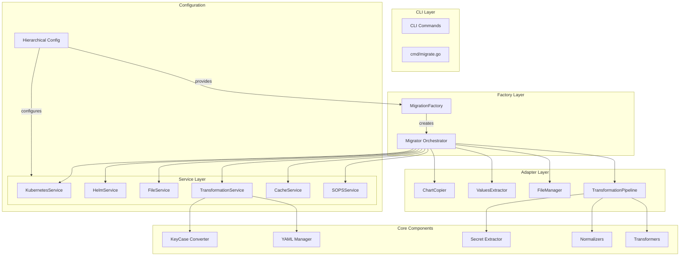
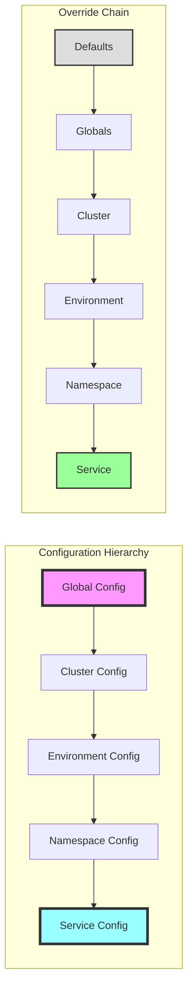
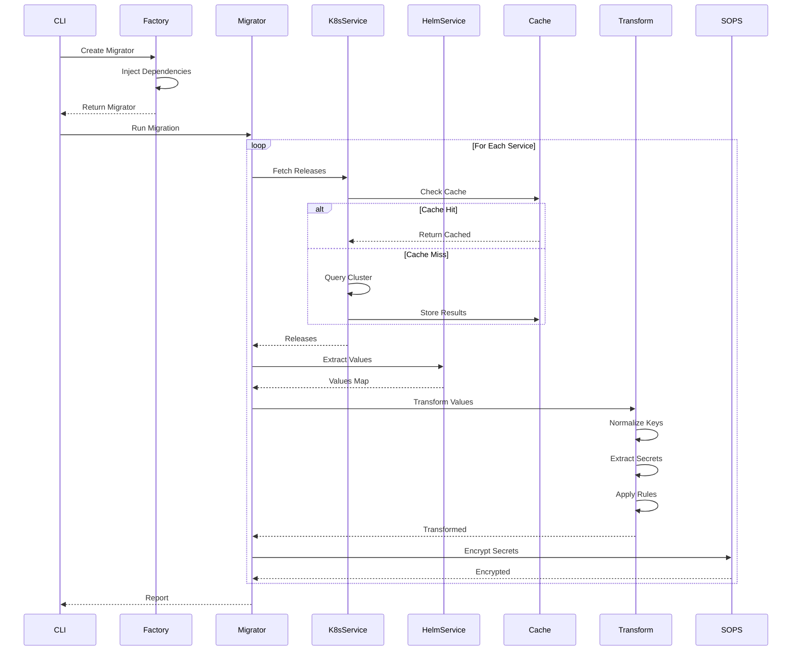

# Helm Charts Migrator - Refactoring Plan & Architecture

## Executive Summary

After deep analysis of the codebase and successful Phase 1 refactoring, this document outlines the complete architecture, identifies remaining improvements, and provides a roadmap for achieving a maintainable, scalable solution following SOLID principles.

## Current Architecture (After Phase 1 Refactoring)

### ✅ Completed Improvements

1. **Service Layer Extraction** - Broke down 1377-line god object into 6 focused services
2. **Dependency Injection** - Implemented proper DI through MigrationFactory
3. **Clean Interfaces** - Each service has a single responsibility
4. **Removed Legacy Code** - Eliminated backward compatibility as requested

### 📊 Architecture Overview



## Proposed Target Architecture

### 🎯 Hierarchical Configuration Architecture



### 🏗️ Migration Pipeline Architecture



## 🔍 Deep Dive Analysis Results

### Critical Issues Found

#### 1. **Incomplete Feature Implementation**
The refactored code is missing several key features from README.md:

- **Manifest Extraction** (Step 9.5 in README)
  - Datadog v1 to v2 conversion not implemented
  - Container configuration extraction missing
  - Probe configurations not extracted

- **Legacy Values Merge** (Step 10.3)
  - Comment preservation during merge not implemented
  - Tracking of added/updated keys missing

- **Transformation Report** (Step 10.5)
  - No report generation implemented
  - Missing transformation tracking

#### 2. **Dead Code to Remove**

```bash
# Files that should be removed:
v1/pkg/migration/k8s_pod_extractor.go
v1/pkg/migration/k8s_pod_extractor_test.go
v1/pkg/migration/manifest_extractor.go
v1/pkg/migration/k8s_resources_extractor.go
v1/pkg/migration/generic_manifest_extractor.go
v1/pkg/migration/value_objects.go
v1/pkg/migration/value_objects_test.go
v1/pkg/migration/cache_metadata.go
v1/pkg/migration/cache_metadata_test.go

# These files contain old implementations that conflict with the new architecture
```

#### 3. **SOLID Principle Violations**

1. **Single Responsibility Principle (SRP)**
   - `adapters.go` is doing too much (900+ lines)
   - Should be split into separate files per adapter

2. **Open/Closed Principle (OCP)**
   - Transformation pipeline is not easily extensible
   - Should use plugin pattern for transformers

3. **Dependency Inversion Principle (DIP)**
   - Some adapters directly depend on concrete implementations
   - Should depend on interfaces

#### 4. **DRY Violations**

- Path building logic duplicated in multiple places
- YAML reading/writing code repeated
- Error handling patterns inconsistent

## 📋 Refactoring Phase 2 Plan

### Week 1: Complete Missing Features

#### Task 1.1: Implement Manifest Extraction

```go
// pkg/services/manifest_service.go
type ManifestService interface {
    ExtractDeployment(manifest string) (*DeploymentConfig, error)
    ConvertDatadogAnnotations(annotations map[string]string) (*DatadogConfig, error)
    ExtractProbes(container *v1.Container) (*ProbeConfig, error)
}

type DeploymentConfig struct {
    Image       ImageConfig
    Probes      ProbeConfig
    Resources   ResourceConfig
    Datadog     DatadogConfig
    Environment []EnvVar
}
```

#### Task 1.2: Implement Legacy Values Merge with Comment Preservation

```go
// pkg/services/merge_service.go
type MergeService interface {
    MergeWithComments(base, override *yaml.Node) (*yaml.Node, *MergeReport)
    TrackChanges(before, after map[string]interface{}) *ChangeSet
}

type MergeReport struct {
    AddedKeys   []string
    UpdatedKeys []string
    Conflicts   []string
}
```

#### Task 1.3: Implement Transformation Report

```go
// pkg/services/report_service.go
type ReportService interface {
    StartReport(serviceName string)
    RecordTransformation(file string, transformation Transformation)
    RecordExtraction(file string, extraction Extraction)
    GenerateReport() (*TransformationReport, error)
    SaveReport(path string) error
}
```

### Week 2: Apply SOLID Principles

#### Task 2.1: Split Adapters into Separate Files

```
pkg/adapters/
├── chart_copier.go
├── values_extractor.go
├── file_manager.go
└── transformation_pipeline.go
```

#### Task 2.2: Implement Plugin Pattern for Transformers

```go
// pkg/transformers/registry.go
type TransformerRegistry struct {
    transformers map[string]Transformer
}

func (r *TransformerRegistry) Register(name string, t Transformer) {
    r.transformers[name] = t
}

func (r *TransformerRegistry) Apply(name string, data interface{}) (interface{}, error) {
    if t, exists := r.transformers[name]; exists {
        return t.Transform(data)
    }
    return nil, fmt.Errorf("transformer %s not found", name)
}
```

#### Task 2.3: Create Proper Interfaces for All Dependencies

```go
// pkg/interfaces/dependencies.go
type Dependencies struct {
    Kubernetes KubernetesService
    Helm       HelmService
    File       FileService
    Transform  TransformationService
    Cache      CacheService
    SOPS       SOPSService
    Manifest   ManifestService
    Merge      MergeService
    Report     ReportService
}
```

### Week 3: Implement Hierarchical Configuration

#### Task 3.1: Configuration Override System

```go
// pkg/config/hierarchy.go
type HierarchicalConfig struct {
    defaults   ConfigLayer
    globals    ConfigLayer
    clusters   map[string]ConfigLayer
    envs       map[string]ConfigLayer
    namespaces map[string]ConfigLayer
    services   map[string]ConfigLayer
}

func (h *HierarchicalConfig) GetEffectiveConfig(
    cluster, env, namespace, service string,
) *Config {
    // Apply override chain
    config := h.defaults.Clone()
    config.Merge(h.globals)
    config.Merge(h.clusters[cluster])
    config.Merge(h.envs[env])
    config.Merge(h.namespaces[namespace])
    config.Merge(h.services[service])
    return config
}
```

#### Task 3.2: Dynamic Configuration Loading

```go
// pkg/config/loader.go
type ConfigLoader interface {
    LoadFromFile(path string) (*Config, error)
    LoadFromDirectory(dir string) (*Config, error)
    LoadFromCluster(context string) (*Config, error)
    MergeConfigs(configs ...*Config) *Config
}
```

### Week 4: Performance & Testing

#### Task 4.1: Implement Parallel Processing

```go
// pkg/workers/pool.go
type WorkerPool struct {
    workers   int
    tasks     chan Task
    results   chan Result
    errors    chan error
    waitGroup sync.WaitGroup
}

func (p *WorkerPool) Process(tasks []Task) ([]Result, []error) {
    // Parallel processing with proper error handling
}
```

#### Task 4.2: Comprehensive Testing

```go
// Test coverage targets:
// - Services: 90%+ coverage
// - Adapters: 85%+ coverage  
// - Core logic: 95%+ coverage
// - Integration tests for full pipeline
```

## 🧹 Cleanup Plan

### Immediate Removals

```bash
# Remove old migration files
rm v1/pkg/migration/k8s_*.go
rm v1/pkg/migration/manifest_extractor.go
rm v1/pkg/migration/generic_manifest_extractor.go
rm v1/pkg/migration/value_objects*.go
rm v1/pkg/migration/cache_metadata*.go
rm v1/pkg/migration/*_test.go  # Old tests

# Remove unused dependencies
go mod tidy
```

### Code Organization

```
v1/
├── cmd/                    # CLI commands
├── pkg/
│   ├── services/          # Service interfaces & implementations
│   ├── adapters/          # Adapter implementations
│   ├── config/            # Configuration management
│   ├── transformers/      # Transformation plugins
│   ├── normalizers/       # Normalization rules
│   ├── extractors/        # Extraction logic
│   ├── reports/           # Report generation
│   └── utils/             # Shared utilities
└── tests/
    ├── unit/              # Unit tests
    ├── integration/       # Integration tests
    └── fixtures/          # Test data
```

## 📊 Success Metrics

### Code Quality
- **Cyclomatic Complexity**: < 10 per method
- **File Size**: < 500 lines per file
- **Test Coverage**: > 85% overall
- **Code Duplication**: < 5%

### Performance
- **Migration Speed**: < 1s per service
- **Memory Usage**: < 100MB for 100 services
- **Cache Hit Rate**: > 90%
- **Parallel Efficiency**: > 80%

### Maintainability
- **Time to Add Feature**: < 2 hours
- **Bug Fix Time**: < 30 minutes
- **Onboarding Time**: < 1 day
- **Documentation Coverage**: 100%

## 🚀 Implementation Priority

1. **Critical** (Week 1)
   - Implement missing features from README.md
   - Remove dead code
   - Fix compilation issues

2. **High** (Week 2)
   - Apply SOLID principles
   - Split large files
   - Implement proper interfaces

3. **Medium** (Week 3)
   - Hierarchical configuration
   - Plugin architecture
   - Performance optimization

4. **Low** (Week 4)
   - Advanced reporting
   - Monitoring integration
   - Documentation updates

## 🎯 Final Architecture Benefits

1. **Modularity**: Each component has a single, well-defined responsibility
2. **Extensibility**: Easy to add new transformers, extractors, or services
3. **Testability**: All components can be tested in isolation
4. **Maintainability**: Clear separation of concerns, consistent patterns
5. **Performance**: Parallel processing, efficient caching, optimized operations
6. **Flexibility**: Hierarchical configuration allows fine-grained control

## Conclusion

The Phase 1 refactoring successfully broke down the god object and established a clean service architecture. Phase 2 will complete the implementation, ensuring all features from README.md are working while maintaining the improved architecture. The hierarchical configuration system will provide maximum flexibility while keeping the code DRY and following SOLID principles.

Estimated completion: 4 weeks with 2 developers, or 6-8 weeks with 1 developer.