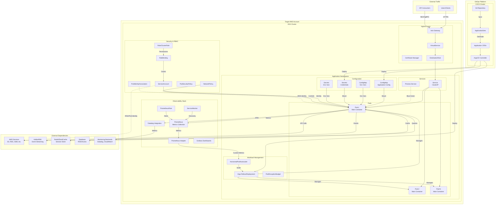
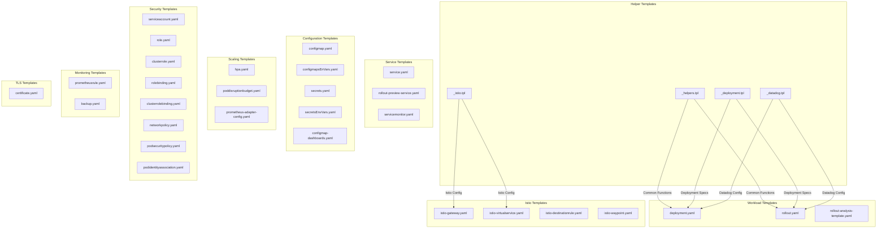
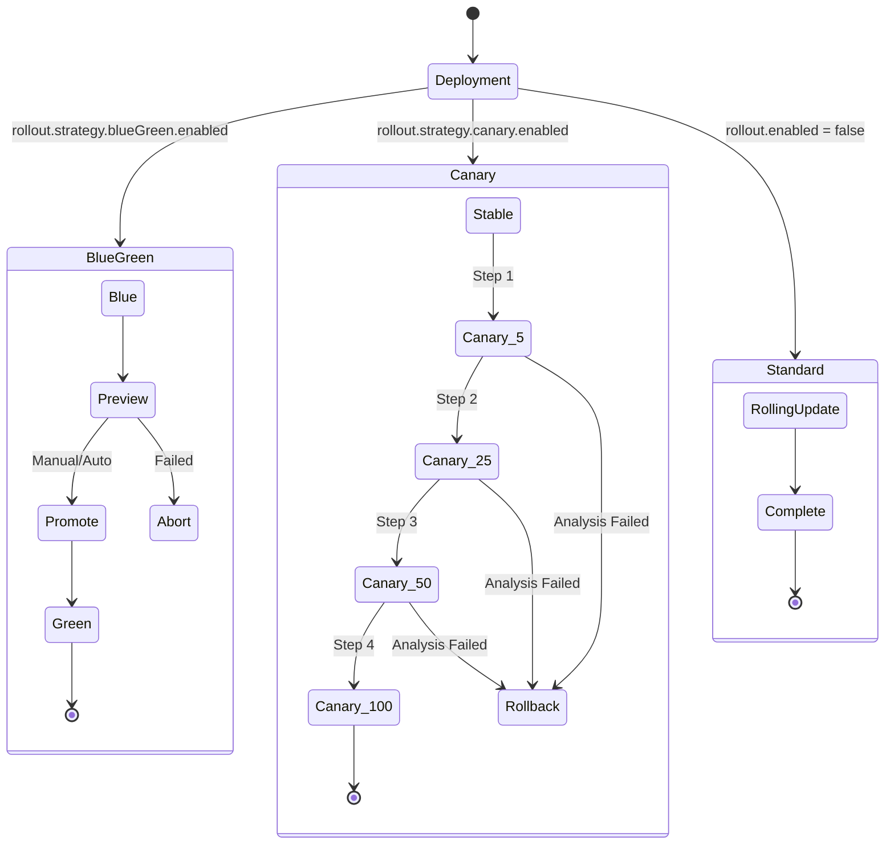
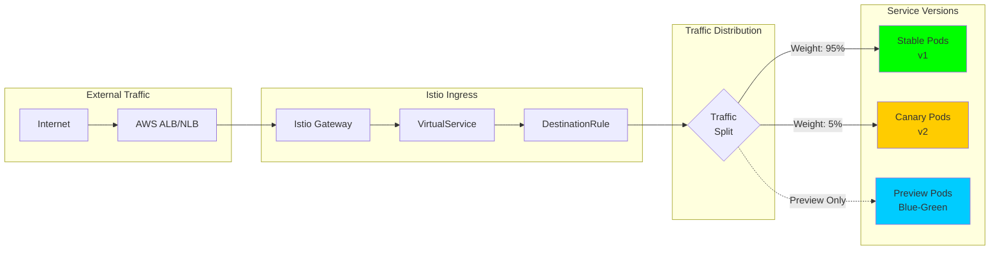
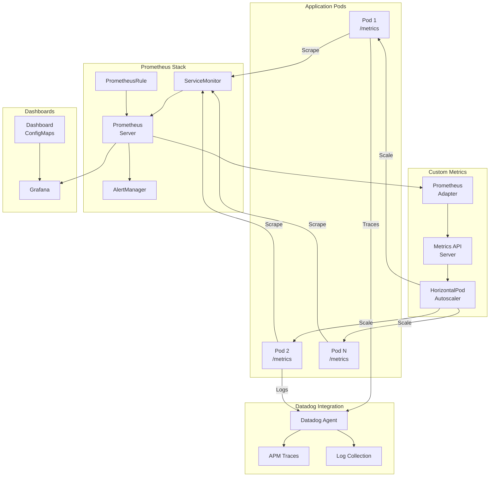
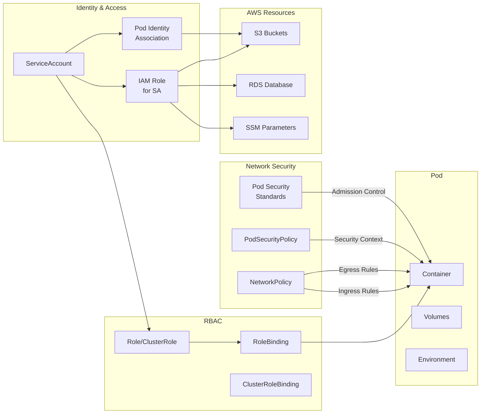
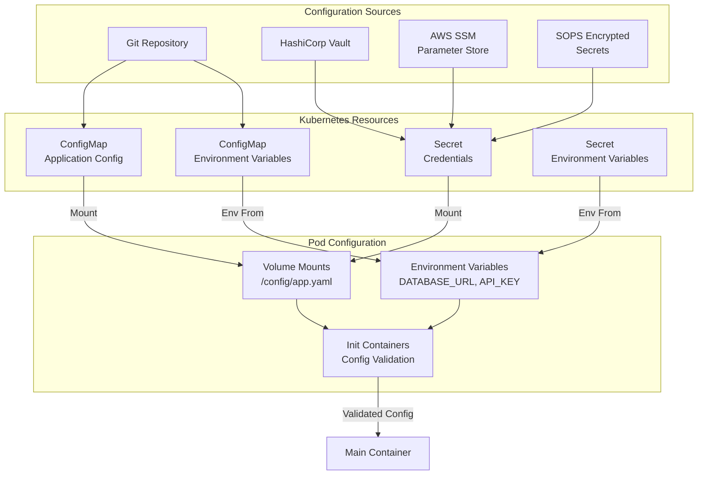
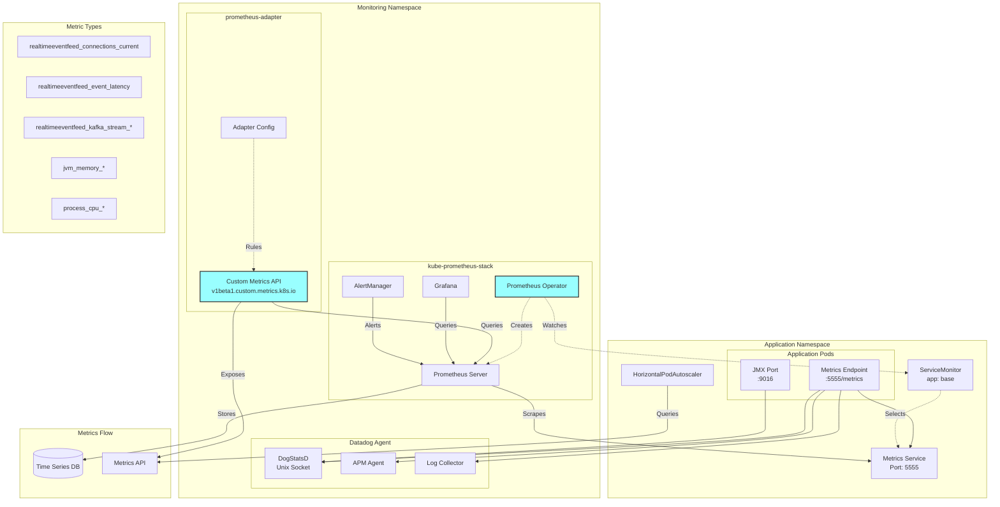
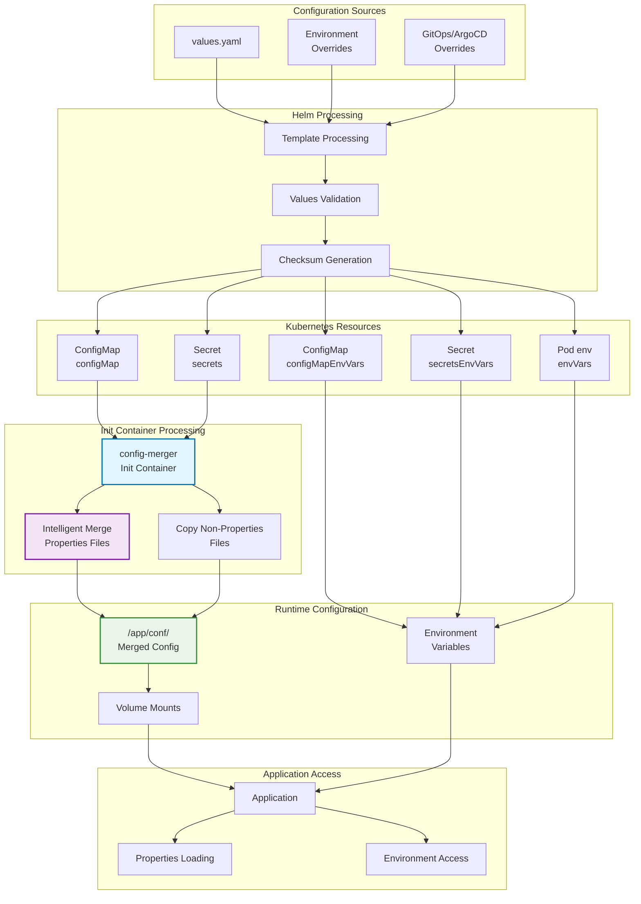
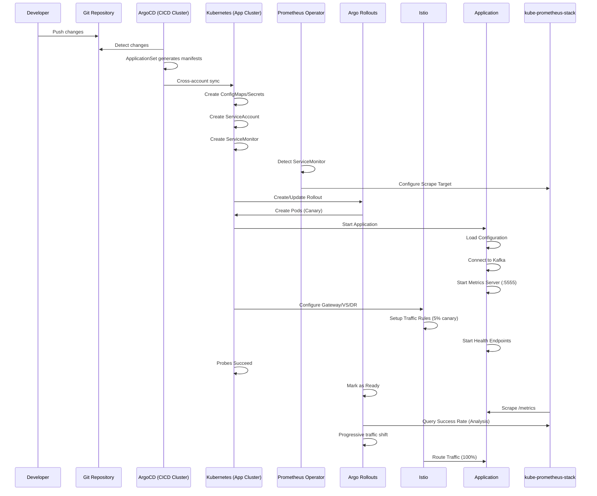

# # base-chart

Helm chart for Base-Chart Base-Chart-Type. It has a comprehensive security, operational excellence, and business continuity features

  

## Overview

This Helm chart provides a comprehensive deployment solution for containerized applications on Kubernetes with support for:
- Progressive delivery strategies (Blue-Green, Canary) via Argo Rollouts
- Service mesh integration (Istio)
- Auto-scaling (HPA with custom metrics)
- Observability (Prometheus, Datadog)
- Security policies and RBAC
- AWS integration (IRSA, Pod Identity)

## Chart Components Architecture

### High-Level Deployment Architecture



## Template Structure

### Core Templates Hierarchy



## Deployment Strategies

### Progressive Delivery with Argo Rollouts



### Service Mesh Traffic Flow (Istio)



## Observability Stack

### Metrics Collection and Alerting



## Security Architecture

### RBAC and Network Policies



## Configuration Management

### ConfigMaps and Secrets Flow





### 4. Configuration Management

The chart provides a sophisticated configuration management system that handles both file-based and environment variable configurations, with intelligent merging between ConfigMaps and Secrets.



#### Configuration Processing Flow

1. **Template Processing**: Helm processes values.yaml and generates Kubernetes resources
2. **Resource Creation**: Four types of configuration resources are created:
   - **ConfigMap (configMap)**: File-based configuration (.properties files)
   - **ConfigMap (configMapEnvVars)**: Environment variables from ConfigMaps
   - **Secret (secrets)**: Sensitive file-based configuration
   - **Secret (secretsEnvVars)**: Sensitive environment variables

3. **Init Container Merge**: The `config-merger` init container intelligently merges configurations:
   - **Properties Files**: Merges .properties files from both ConfigMap and Secret
   - **Non-Properties Files**: Copies all other files from both sources
   - **Precedence**: Secret values override ConfigMap values for same keys

4. **Runtime Delivery**: Applications access configuration through:
   - **Volume Mounts**: Merged files in `/app/conf/`
   - **Environment Variables**: Loaded from configMapEnvVars and secretsEnvVars
   - **Direct Access**: Original ConfigMap and Secret mounts available

#### Configuration Types and Usage

```yaml
# values.yaml configuration structure
configMap:
  application.properties:
    server.port: 8080
    kafka.bootstrap.servers: "localhost:9092"
    logging.level.com.viafoura: DEBUG

  vfmetrics.properties:
    metrics.port: 5555
    metrics.path: /metrics
    metrics.enabled: true

secrets:
  application.properties:
    kafka.username: "secure-user"
    kafka.password: "secure-password"
    database.password: "db-secret"

  credentials.properties:
    api.key: "secret-api-key"
    jwt.secret: "signing-secret"

configMapEnvVars:
  LOG_LEVEL: "INFO"
  DEBUG_MODE: "false"
  API_TIMEOUT: "30s"

secretsEnvVars:
  DATABASE_PASSWORD: "postgres-password"
  API_TOKEN: "external-service-token"

envVars:
  JAVA_OPTIONS: "-Xms100m -Xmx100m"  # Example for Java services
```

#### Merge Behavior

The init container performs intelligent merging:

1. **Properties Files with Same Name**:
   ```properties
   # Final application.properties (merged)
   # ConfigMap properties
   server.port=8080
   kafka.bootstrap.servers=localhost:9092

   # Secret properties (override ConfigMap)
   kafka.username=secure-user
   kafka.password=secure-password
   ```

2. **File Precedence**:
   - Properties files: ConfigMap + Secret (merged)
   - Non-properties files: Secret overrides ConfigMap if same filename
   - Unique files: Copied from respective sources

3. **Volume Mount Structure**:
   ```bash
   /app/conf/                    # Merged configuration (primary)
   ├── application.properties    # Merged ConfigMap + Secret
   ├── vfmetrics.properties     # From ConfigMap only
   └── credentials.properties   # From Secret only

   /app/configmap/              # Original ConfigMap files
   /app/secrets/                # Original Secret files
   ```

#### Security Considerations

- **Checksum Updates**: Configuration changes trigger pod restarts via checksum annotations
- **Read-Only Access**: Configuration volumes are mounted read-only in main container
- **Secure Init**: Init container runs with minimal security context
- **Separation**: Clear separation between sensitive and non-sensitive configuration

## Monitoring Stack Integration

### kube-prometheus-stack Integration

The chart integrates with the **kube-prometheus-stack** (v0.83.0) for comprehensive monitoring:

1. **ServiceMonitor Resource**:
   - Automatically discovered by Prometheus Operator
   - Labeled with `release: kube-prometheus-stack` for proper selection
   - Configures scraping of metrics endpoint every 10s

2. **Prometheus Server**:
   - Deployed in `monitoring` namespace
   - Scrapes metrics from all pods via the metrics service
   - Stores time-series data for querying

3. **Grafana Integration**:
   - Custom dashboard included in ConfigMap
   - Visualizes application-specific metrics

### prometheus-adapter Integration

The **prometheus-adapter** (v0.12.0) enables custom metrics for autoscaling:

1. **Custom Metrics API**:
   - Exposes Prometheus metrics as Kubernetes custom metrics
   - Implements `custom.metrics.k8s.io/v1beta1` API

2. **HPA Integration**:
   - HPA queries custom metrics like `realtimeeventfeed_connections_current`
   - Enables scaling based on business metrics, not just CPU/memory

3. **Configuration**:
   ```yaml
   # Example prometheus-adapter rule
   rules:
   - seriesQuery: 'realtimeeventfeed_connections_current'
     resources:
       overrides:
         namespace: {resource: "namespace"}
         pod: {resource: "pod"}
     name:
       matches: "^realtimeeventfeed_(.*)$"
       as: "${1}"
     metricsQuery: 'avg_over_time(<<.Series>>{<<.LabelMatchers>>}[2m])'
   ```

## Key Features

### 1. High Availability
- **Multi-replica deployment** with pod anti-affinity
- **PodDisruptionBudget** ensuring minimum availability
- **Health checks**: Liveness, Readiness, and Startup probes
- **Automatic scaling** based on CPU, memory, or custom metrics

### 2. Security
- **ServiceAccount with IRSA** for AWS integration
- **Network policies** via Istio
- **TLS termination** at Gateway level
- **Secrets management** with encryption

### 3. Observability
- **Prometheus metrics** with ServiceMonitor
- **Datadog integration** for APM and logs
- **Distributed tracing** support
- **Custom dashboards** included

### 4. Traffic Management
- **Progressive delivery** with canary deployments
- **A/B testing** capabilities
- **Circuit breaking** and retry policies
- **Load balancing** with connection pooling

## Deployment Flow



## Resource Hierarchy

```yaml
Namespace
├── ServiceAccount (with IAM role)
├── ConfigMaps
│   ├── application.properties
│   ├── vfmetrics.properties
│   └── dashboard.json
├── Secrets
│   ├── API credentials
│   └── Environment secrets
├── Rollout (Argo)
│   ├── ReplicaSet (stable)
│   │   └── Pods
│   └── ReplicaSet (canary)
│       └── Pods
├── Services
│   ├── Main Service (8080)
│   └── Metrics Service (5555)
├── Monitoring
│   ├── ServiceMonitor
│   └── HorizontalPodAutoscaler
├── Istio Resources
│   ├── Gateway
│   ├── VirtualService
│   ├── DestinationRule
│   └── EnvoyFilter
└── PodDisruptionBudget
```

## Kubernetes Resource Calculation Guidelines

### Overview
This document provides formulas for calculating optimal Kubernetes resource values for containerized applications, with examples for JVM-based services using `-Xms100m -Xmx100m` heap settings.

### Memory Calculation Formula

#### Base Components
```
Total Container Memory = Heap + Non-Heap + Direct Memory + JVM Overhead + OS Buffer

Where:
- Heap = -Xmx value
- Non-Heap = Metaspace + Code Cache + Thread Stacks + JVM Internal
- Direct Memory = MaxDirectMemorySize (defaults to -Xmx if not set)
- JVM Overhead = ~8-15% of (Heap + Non-Heap)
- OS Buffer = ~10-20MB for container processes
```

#### Detailed Memory Request Calculation

For `-Xmx100m`:

```
Memory Request Calculation:
━━━━━━━━━━━━━━━━━━━━━━━━━
Heap Memory          = 100 MB  (-Xmx100m)
Metaspace           ≈  30 MB  (default ~20-50MB)
Code Cache          ≈  15 MB  (default ~15-50MB)
Thread Stacks       ≈  10 MB  (10 threads × 1MB stack)
Other JVM Native    ≈  10 MB  (GC structures, symbols)
Direct Memory       ≈  50 MB  (Netty buffers, ~50% of heap)
JVM Overhead        ≈  20 MB  (~10% of above)
OS/Container Buffer ≈  20 MB
                      -------
Total               ≈ 255 MB → Round to 256Mi (power of 2)
```

#### Memory Limit Calculation

```
Memory Limit Calculation:
━━━━━━━━━━━━━━━━━━━━━━━━
Base (from above)   = 255 MB
Safety Factor       = 2x      (for spikes, GC, peak load)
                      -------
Total               = 510 MB → Round to 512Mi
```

### CPU Calculation Formula

#### Base Formula
```
CPU Request = max(JVM threads × 10m, 100m)
CPU Limit = CPU Request × 3-5x (for burst capacity)

Where:
- JVM threads ≈ 10-20 for typical Java app
- 10m = 0.01 CPU core per thread baseline
- Minimum 100m for scheduling priority
```

#### Application-Specific CPU Calculation

```
CPU Request Calculation:
━━━━━━━━━━━━━━━━━━━━━━━
Event Loop Threads  = 2 × cores (framework default)
Worker Threads      = 20 (typical default)
GC Threads          = 2-4
Other JVM Threads   = 5-10
                      -------
Total Threads       ≈ 30-40
Min Baseline        = 30 × 3m = 90m
Recommended Min     = 100m (for better scheduling)

CPU Limit Calculation:
━━━━━━━━━━━━━━━━━━━━━
Base Request        = 100m
Burst Factor        = 5x (startup, peak loads)
                      -------
Total               = 500m
```

### Generic Formulas

#### Memory Formula
```python
# Memory Request (Mi)
memory_request = heap + (heap × direct_memory_factor) + metaspace + overhead + buffer

# Memory Limit (Mi)
memory_limit = memory_request × safety_factor

# Where:
# direct_memory_factor = 0.5-1.0 (depends on Netty usage)
# metaspace = 30-50 MB
# overhead = (heap + non_heap) × 0.1
# buffer = 20 MB
# safety_factor = 1.5-2.0
```

#### CPU Formula
```python
# CPU Request (millicores)
cpu_request = max(minimum_cpu, active_threads × cpu_per_thread)

# CPU Limit (millicores)
cpu_limit = cpu_request × burst_factor

# Where:
# minimum_cpu = 100m
# active_threads = event_loops + workers + jvm_threads
# cpu_per_thread = 3-10m
# burst_factor = 3-5
```

### Quick Reference Table

| JVM Heap (-Xmx) | Memory Request | Memory Limit | CPU Request | CPU Limit |
|-----------------|----------------|--------------|-------------|-----------|
| 64m             | 192Mi          | 384Mi        | 100m        | 500m      |
| 100m            | 256Mi          | 512Mi        | 100m        | 500m      |
| 256m            | 512Mi          | 1Gi          | 200m        | 1000m     |
| 512m            | 1Gi            | 2Gi          | 250m        | 1000m     |
| 1g              | 2Gi            | 4Gi          | 500m        | 2000m     |
| 2g              | 4Gi            | 6Gi          | 500m        | 2000m     |

### Key Multipliers

| Component | Multiplier | Reason |
|-----------|-----------|---------|
| Direct Memory | 0.5-1.0 × Heap | Netty allocates off-heap buffers |
| Non-Heap | 0.5-0.8 × Heap | Metaspace, code cache, threads |
| Safety Factor | 2.0x | GC spikes, peak loads |
| CPU Burst | 3-5x | Startup, compilation, peak processing |

### Tuning Guidelines

#### When to Increase Memory
- More Netty channels/connections: Increase direct memory factor to 0.8-1.0
- More threads: Add 1MB per additional thread
- Complex application: Increase metaspace by 20-50%
- Frequent Full GCs: Increase heap and overall memory

#### When to Increase CPU
- High CPU throttling in metrics
- Slow application startup
- Complex computational workloads
- Many concurrent requests

#### When to Decrease Resources
- Stable load patterns: Reduce safety factor to 1.5x
- Simple applications: Reduce metaspace allocation
- Few connections: Reduce direct memory factor to 0.3-0.5

### Example Configurations

#### Minimal Service
```yaml
resources:
  requests:
    memory: "256Mi"
    cpu: "100m"
  limits:
    memory: "512Mi"
    cpu: "500m"
```

#### Standard Service
```yaml
resources:
  requests:
    memory: "512Mi"
    cpu: "250m"
  limits:
    memory: "1Gi"
    cpu: "1000m"
```

#### High-Load Service
```yaml
resources:
  requests:
    memory: "2Gi"
    cpu: "1000m"
  limits:
    memory: "4Gi"
    cpu: "4000m"
```

### Monitoring Commands

```bash
# Check actual memory usage
kubectl top pods -n your-namespace

# Get detailed JVM memory breakdown
kubectl exec -it your-pod -- jcmd 1 VM.native_memory summary

# Check for CPU throttling
kubectl exec -it your-pod -- cat /sys/fs/cgroup/cpu/cpu.stat | grep throttled
```

### Notes

1. These formulas provide starting points; always validate with actual metrics
2. Container memory limits should be ~20% higher than JVM memory to prevent OOMKilled
3. Use HorizontalPodAutoscaler for production workloads
4. Consider using `-XX:+UseContainerSupport` for better container awareness
5. Monitor and adjust based on actual usage patterns

## Configuration Options

### Essential Values

```yaml
# Core Configuration
replicaCount: 2
image:
  repository: aws-ecr-url
  tag: v1.0.0

# Service Configuration
service:
  port: 8080
  containerPorts:
    metrics:
      enabled: true
      exposeService: true

# Autoscaling
autoscaling:
  enabled: true
  minReplicas: 2
  maxReplicas: 5
  targetCPUUtilizationPercentage: 33

# Monitoring
serviceMonitor:
  enabled: true
  prometheusReleaseName: kube-prometheus-stack

# Deployment Strategy
rollout:
  enabled: true
  strategy:
    canary:
      enabled: true
      steps: [5%, 10%, 20%, 50%, 100%]
  analysis:
    prometheus:
      # References in-cluster Prometheus from kube-prometheus-stack
      address: http://kube-prometheus-stack-prometheus.monitoring.svc.cluster.local:9090
```

## Best Practices

1. **Resource Management**
   - Set appropriate resource requests/limits
   - Use HPA for dynamic scaling
   - Configure PDB for availability

2. **Security**
   - Enable IRSA for AWS access
   - Use secrets for sensitive data
   - Configure network policies

3. **Monitoring**
   - Enable ServiceMonitor for Prometheus
   - Configure Datadog for APM
   - Set up alerts for critical metrics

4. **Deployment**
   - Use canary deployments for safety
   - Configure analysis for automatic rollback
   - Test in lower environments first

## Troubleshooting

See [TROUBLESHOOTING.md](./TROUBLESHOOTING.md) for common issues and solutions.

## Testing

The chart includes comprehensive tests:
- Unit tests for template rendering
- Integration tests for Kubernetes resources
- Monitoring tests for observability
- Security tests for compliance

Run tests with:

```bash
helm test <release-name>
```

## Future Enhancements

1. **Multi-region support** with federation across AWS accounts
2. **Advanced traffic management** with locality preferences
3. **Cost optimization** with spot instance support
4. **Enhanced security** with Pod Security Standards
5. **Multi-cluster ArgoCD** with sharding for scale
6. **Progressive delivery** across regions with global rollouts

## Installing the Chart

To install the chart with the release name `my-release`:

```console
$ helm repo add foo-bar http://charts.foo-bar.com
$ helm install my-release foo-bar/base-chart
```

## Update Helm Schema and This README.md

```bash
helm-schema --add-schema-reference --helm-docs-compatibility-mode --append-newline && helm-docs .
```

---

## Values

| Key | Type | Default | Description |
|-----|------|---------|-------------|
| affinity | object | `{}` | Advanced pod scheduling rules for controlling pod placement relative to other pods and nodes Provides fine-grained control over where pods are scheduled in the cluster for performance, compliance, and availability requirements. Use cases: - Co-location: Schedule pods near each other (e.g., app with cache) - Anti-affinity: Spread pods across nodes/zones for high availability - Node affinity: Target specific hardware, zones, or node types - Mixed workload isolation: Separate different application tiers Example configurations: # Pod Anti-Affinity: Spread pods across different nodes for high availability podAntiAffinity:   preferredDuringSchedulingIgnoredDuringExecution:     - weight: 100       podAffinityTerm:         labelSelector:           matchExpressions:             - key: app.kubernetes.io/name               operator: In               values:                 - base-chart         topologyKey: kubernetes.io/hostname  # Zone Anti-Affinity: Distribute pods across availability zones podAntiAffinity:   preferredDuringSchedulingIgnoredDuringExecution:     - weight: 80       podAffinityTerm:         labelSelector:           matchLabels:             app.kubernetes.io/name: base-chart         topologyKey: topology.kubernetes.io/zone  # Node Affinity: Prefer compute-optimized nodes for CPU-intensive workloads nodeAffinity:   preferredDuringSchedulingIgnoredDuringExecution:     - weight: 100       preference:         matchExpressions:           - key: node-type             operator: In             values:               - compute-optimized               - cpu-optimized  # Required Node Affinity: Must run on nodes with SSD storage nodeAffinity:   requiredDuringSchedulingIgnoredDuringExecution:     nodeSelectorTerms:       - matchExpressions:           - key: storage-type             operator: In             values:               - ssd  # Pod Affinity: Co-locate with Redis cache for low latency podAffinity:   preferredDuringSchedulingIgnoredDuringExecution:     - weight: 100       podAffinityTerm:         labelSelector:           matchLabels:             app: redis         topologyKey: kubernetes.io/hostname |
| alerts | object | `{"customRules":[],"dashboardUrl":"https://grafana.example.com/d/base-chart","enabled":false,"evaluationInterval":"30s","labels":{},"rules":{"connectionDropRate":{"duration":"5m","enabled":true,"severity":"warning","threshold":10},"highConnectionsPerPod":{"duration":"2m","enabled":true,"severity":"warning","threshold":45000},"highGCPauseTime":{"duration":"5m","enabled":true,"severity":"warning","threshold":200},"messageLatency":{"duration":"5m","enabled":true,"severity":"warning","threshold":500},"podMemory":{"duration":"5m","enabled":true,"severity":"warning","threshold":90},"podRestarts":{"duration":"5m","enabled":true,"severity":"critical","threshold":2},"serviceDown":{"duration":"2m","enabled":true,"severity":"critical"}},"runbookUrl":"https://wiki.example.com/runbooks/base-chart"}` | Prometheus alerting rules configuration |
| alerts.customRules | list | `[]` | Custom alert rules |
| alerts.dashboardUrl | string | `"https://grafana.example.com/d/base-chart"` | Dashboard URL for alert annotations |
| alerts.enabled | bool | `false` | Enable Prometheus alerting rules |
| alerts.evaluationInterval | string | `"30s"` | How often to evaluate alert rules |
| alerts.labels | object | `{}` | Additional labels for PrometheusRule |
| alerts.rules | object | `{"connectionDropRate":{"duration":"5m","enabled":true,"severity":"warning","threshold":10},"highConnectionsPerPod":{"duration":"2m","enabled":true,"severity":"warning","threshold":45000},"highGCPauseTime":{"duration":"5m","enabled":true,"severity":"warning","threshold":200},"messageLatency":{"duration":"5m","enabled":true,"severity":"warning","threshold":500},"podMemory":{"duration":"5m","enabled":true,"severity":"warning","threshold":90},"podRestarts":{"duration":"5m","enabled":true,"severity":"critical","threshold":2},"serviceDown":{"duration":"2m","enabled":true,"severity":"critical"}}` | Alert rule configurations |
| alerts.runbookUrl | string | `"https://wiki.example.com/runbooks/base-chart"` | Runbook URL base for alert documentation |
| arch | string | `"amd64"` | Target CPU architecture for container scheduling and node selection Ensures pods run on compatible nodes (amd64 for Intel/AMD, arm64 for ARM processors) |
| autoscaling | object | `{"behavior":{"scaleDown":{"policies":[{"periodSeconds":60,"type":"Percent","value":10},{"periodSeconds":60,"type":"Pods","value":1}],"selectPolicy":"Min","stabilizationWindowSeconds":300},"scaleUp":{"policies":[{"periodSeconds":60,"type":"Percent","value":100},{"periodSeconds":60,"type":"Pods","value":2}],"selectPolicy":"Max","stabilizationWindowSeconds":60}},"enabled":true,"externalMetrics":{"connectionMetricName":"realtimeeventfeed_connections_current","enabled":true},"maxReplicas":10,"minReplicas":1,"target":{"maxConnections":"1000"},"targetCPUUtilizationPercentage":70,"targetMemoryUtilizationPercentage":80}` | Horizontal Pod Autoscaler for automatic scaling based on resource utilization and custom metrics |
| autoscaling.behavior | object | `{"scaleDown":{"policies":[{"periodSeconds":60,"type":"Percent","value":10},{"periodSeconds":60,"type":"Pods","value":1}],"selectPolicy":"Min","stabilizationWindowSeconds":300},"scaleUp":{"policies":[{"periodSeconds":60,"type":"Percent","value":100},{"periodSeconds":60,"type":"Pods","value":2}],"selectPolicy":"Max","stabilizationWindowSeconds":60}}` | Horizontal Pod Autoscaler Behavior |
| autoscaling.enabled | bool | `true` | Enable automatic pod scaling to handle varying traffic loads |
| autoscaling.externalMetrics | object | `{"connectionMetricName":"realtimeeventfeed_connections_current","enabled":true}` | External metrics from Prometheus for custom scaling decisions |
| autoscaling.externalMetrics.connectionMetricName | string | `"realtimeeventfeed_connections_current"` | Prometheus metric name for active connection count monitoring |
| autoscaling.externalMetrics.enabled | bool | `true` | Use external metrics like connection count, queue depth, or response time for scaling |
| autoscaling.maxReplicas | int | `10` | Maximum pod count to prevent resource exhaustion and cost overruns |
| autoscaling.minReplicas | int | `1` | Minimum pod count to maintain for baseline capacity and availability |
| autoscaling.target | object | `{"maxConnections":"1000"}` | Target values for autoscaling metrics |
| autoscaling.target.maxConnections | string | `"1000"` | Maximum connections per pod before scaling up (average) |
| autoscaling.targetCPUUtilizationPercentage | int | `70` | CPU utilization threshold |
| autoscaling.targetMemoryUtilizationPercentage | int | `80` | Memory utilization threshold |
| awsAccountId | string | `"218894879100"` | AWS Account ID |
| backup | object | `{"cronjob":{"activeDeadlineSeconds":3600,"backoffLimit":2,"backupType":"application-data","concurrencyPolicy":"Forbid","enabled":false,"extraEnv":{},"failedJobsHistoryLimit":1,"image":{"pullPolicy":"IfNotPresent","repository":"amazon/aws-cli","tag":"2.13.0"},"nodeSelector":{},"resources":{"limits":{"cpu":"500m","memory":"512Mi"},"requests":{"cpu":"100m","memory":"128Mi"}},"retentionDays":30,"s3":{"bucket":"","prefix":"backups"},"schedule":"0 3 * * *","startingDeadlineSeconds":300,"successfulJobsHistoryLimit":3,"timeZone":"UTC","tolerations":[],"volumeMounts":[],"volumes":[]},"enabled":false,"monitoring":{"alerting":{"channels":["slack","email"],"enabled":true,"severity":"warning"},"enabled":true,"metrics":{"enabled":true,"interval":"30s","path":"/metrics"}},"velero":{"customResources":["rollouts.argoproj.io","virtualservices.networking.istio.io","destinationrules.networking.istio.io","gateways.networking.istio.io"],"enabled":false,"hooks":{"enabled":true},"includeCustomResources":true,"namespace":"velero","retention":"720h","schedule":"0 2 * * *","storageLocation":"default","volumeSnapshotLocations":["default"]}}` | Backup automation configuration for operational excellence Provides multiple backup strategies including Velero and custom CronJob backups |
| backup.cronjob | object | `{"activeDeadlineSeconds":3600,"backoffLimit":2,"backupType":"application-data","concurrencyPolicy":"Forbid","enabled":false,"extraEnv":{},"failedJobsHistoryLimit":1,"image":{"pullPolicy":"IfNotPresent","repository":"amazon/aws-cli","tag":"2.13.0"},"nodeSelector":{},"resources":{"limits":{"cpu":"500m","memory":"512Mi"},"requests":{"cpu":"100m","memory":"128Mi"}},"retentionDays":30,"s3":{"bucket":"","prefix":"backups"},"schedule":"0 3 * * *","startingDeadlineSeconds":300,"successfulJobsHistoryLimit":3,"timeZone":"UTC","tolerations":[],"volumeMounts":[],"volumes":[]}` | Custom CronJob backup for application-specific data |
| backup.cronjob.activeDeadlineSeconds | int | `3600` | Maximum time for backup job to complete |
| backup.cronjob.backoffLimit | int | `2` | Number of retries for failed backup jobs |
| backup.cronjob.backupType | string | `"application-data"` | Type of backup to perform |
| backup.cronjob.concurrencyPolicy | string | `"Forbid"` | Concurrency policy for backup jobs |
| backup.cronjob.enabled | bool | `false` | Enable CronJob-based backup |
| backup.cronjob.extraEnv | object | `{}` | Additional environment variables for backup job |
| backup.cronjob.failedJobsHistoryLimit | int | `1` | Number of failed backup jobs to retain |
| backup.cronjob.image | object | `{"pullPolicy":"IfNotPresent","repository":"amazon/aws-cli","tag":"2.13.0"}` | Container image for backup executor |
| backup.cronjob.nodeSelector | object | `{}` | Node selector for backup job placement |
| backup.cronjob.resources | object | `{"limits":{"cpu":"500m","memory":"512Mi"},"requests":{"cpu":"100m","memory":"128Mi"}}` | Resource limits and requests for backup job |
| backup.cronjob.retentionDays | int | `30` | Retention period for backups (in days) |
| backup.cronjob.s3 | object | `{"bucket":"","prefix":"backups"}` | S3 configuration for backup storage |
| backup.cronjob.s3.bucket | string | `""` | S3 bucket for backup storage |
| backup.cronjob.s3.prefix | string | `"backups"` | S3 prefix for backup objects |
| backup.cronjob.schedule | string | `"0 3 * * *"` | Backup schedule in cron format (default: daily at 3 AM) |
| backup.cronjob.startingDeadlineSeconds | int | `300` | Deadline for backup job to start |
| backup.cronjob.successfulJobsHistoryLimit | int | `3` | Number of successful backup jobs to retain |
| backup.cronjob.timeZone | string | `"UTC"` | Timezone for backup schedule |
| backup.cronjob.tolerations | list | `[]` | Tolerations for backup job scheduling |
| backup.cronjob.volumeMounts | list | `[]` | Additional volume mounts for backup job |
| backup.cronjob.volumes | list | `[]` | Additional volumes for backup job |
| backup.enabled | bool | `false` | Enable backup automation features |
| backup.monitoring | object | `{"alerting":{"channels":["slack","email"],"enabled":true,"severity":"warning"},"enabled":true,"metrics":{"enabled":true,"interval":"30s","path":"/metrics"}}` | Monitoring configuration for backup operations |
| backup.monitoring.alerting | object | `{"channels":["slack","email"],"enabled":true,"severity":"warning"}` | Alerting configuration for backup failures |
| backup.monitoring.alerting.channels | list | `["slack","email"]` | Alert notification channels |
| backup.monitoring.alerting.enabled | bool | `true` | Enable backup failure alerts |
| backup.monitoring.alerting.severity | string | `"warning"` | Alert severity levels |
| backup.monitoring.enabled | bool | `true` | Enable backup monitoring and metrics |
| backup.monitoring.metrics | object | `{"enabled":true,"interval":"30s","path":"/metrics"}` | Prometheus metrics for backup status |
| backup.monitoring.metrics.enabled | bool | `true` | Enable backup metrics collection |
| backup.monitoring.metrics.interval | string | `"30s"` | Metrics collection interval |
| backup.monitoring.metrics.path | string | `"/metrics"` | Metrics endpoint path |
| backup.velero | object | `{"customResources":["rollouts.argoproj.io","virtualservices.networking.istio.io","destinationrules.networking.istio.io","gateways.networking.istio.io"],"enabled":false,"hooks":{"enabled":true},"includeCustomResources":true,"namespace":"velero","retention":"720h","schedule":"0 2 * * *","storageLocation":"default","volumeSnapshotLocations":["default"]}` | Velero backup configuration for full cluster backup |
| backup.velero.customResources | list | `["rollouts.argoproj.io","virtualservices.networking.istio.io","destinationrules.networking.istio.io","gateways.networking.istio.io"]` | Custom resources to include in backup |
| backup.velero.enabled | bool | `false` | Enable Velero backup scheduling |
| backup.velero.namespace | string | `"velero"` | Velero namespace (default: velero) |
| backup.velero.retention | string | `"720h"` | Backup retention period (default: 30 days) |
| backup.velero.schedule | string | `"0 2 * * *"` | Backup schedule in cron format (default: daily at 2 AM) |
| backup.velero.storageLocation | string | `"default"` | Storage location for backups |
| backup.velero.volumeSnapshotLocations | list | `["default"]` | Volume snapshot locations for persistent volumes |
| configMap | object | `{"vfmetrics.properties":{"namespace":"realtimeeventfeed"}}` | ConfigMap files for application configuration, properties, and settings Files are mounted to /var/migrator/jetty/resources via projected volume (optional, read-only) Combined with secrets in a single mount point for unified configuration access |
| configMapEnvVars | object | `{}` | Environment variables loaded from ConfigMaps for non-sensitive configuration Useful for feature flags, API endpoints, logging levels, and operational settings Example configuration: LOG_LEVEL: INFO                     # Application logging verbosity DEBUG_MODE: "false"                 # Enable debug features API_TIMEOUT: "30s"                  # External API timeout CACHE_TTL: "300"                    # Cache time-to-live in seconds |
| datadog | object | `{"apm":{"enabled":false,"environment":"production","serviceName":"base-chart"},"collectAllMetrics":true,"collectHistogramBuckets":true,"containerName":"base-chart","enabled":true,"healthServiceCheck":true,"ignoreMetrics":["go_gc_.*","go_goroutines","process_.*_bytes","prometheus_.*","up"],"initConfig":{},"instanceConfig":{},"integration":"jmx","jmx":{"collectDefaultMetrics":true,"collect_default_jvm_metrics":true,"conf":[{"include":{"attribute":{"HeapMemoryUsage":{"alias":"jvm.heap_memory","metric_type":"gauge"},"NonHeapMemoryUsage":{"alias":"jvm.non_heap_memory","metric_type":"gauge"}},"domain":"java.lang","type":"Memory"}},{"include":{"attribute":{"CollectionCount":{"alias":"jvm.gc.cms.count","metric_type":"counter"},"CollectionTime":{"alias":"jvm.gc.cms.time","metric_type":"counter"}},"domain":"java.lang","name":"*","type":"GarbageCollector"}},{"include":{"attribute":{"DaemonThreadCount":{"alias":"jvm.daemon_thread_count","metric_type":"gauge"},"ThreadCount":{"alias":"jvm.thread_count","metric_type":"gauge"}},"domain":"java.lang","type":"Threading"}},{"include":{"attribute":{"ActiveConnections":{"alias":"app.db.active_connections","metric_type":"gauge"},"IdleConnections":{"alias":"app.db.idle_connections","metric_type":"gauge"}},"domain":"com.your.app","type":"ConnectionPool"}}],"isJmx":true,"java_bin_path":"","java_options":"","jmxUrl":"","key_store_password":"","key_store_path":"","name":"","new_gc_metrics":true,"password":"","processNameRegex":"","rmi_client_timeout":15000,"rmi_connection_timeout":20000,"rmi_registry_ssl":false,"service_check_prefix":"jmx","tools_jar_path":"","trust_store_password":"","trust_store_path":"","user":""},"logs":{"enabled":true,"logProcessingRules":[{"name":"exclude_health_checks","pattern":"GET /health","type":"exclude_at_match"},{"name":"mask_credit_cards","pattern":"\\d{4}[\\s-]?\\d{4}[\\s-]?\\d{4}[\\s-]?\\d{4}","replacement":"****-****-****-****","type":"mask_sequences"}],"service":"base-chart","source":"base-chart"},"metricTransformations":{"labels":[{"from":"handler","to":"endpoint"},{"from":"method","to":"http_method"},{"from":"status_code","to":"response_code"}]},"metrics":["http_requests_total","http_request_duration_seconds","database_connections_active",{"source":"go_memstats_alloc_bytes","target":"memory_allocated"},{"source":"process_cpu_seconds_total","target":"cpu_usage_seconds"},{"source":"base_custom_metric_total","target":"custom_operations"},{"source":"prometheus_rule_evaluation_duration_seconds","target":"rule_evaluation_time"}],"metricsPath":"/metrics","namespace":"base-chart","sendHistogramsBuckets":true,"tags":{"env":"production","service":"base-chart","team":"backend"},"timeout":20}` | Datadog configuration Alternative configuration for collecting all metrics additionalProperties: true datadog:   enabled: true   containerName: "base-chart"   namespace: "base-chart"   metricsPath: "/metrics"   collectAllMetrics: true   ignoreMetrics:     - "go_.*"     - "process_.*"     - "prometheus_.*"   tags:     - "env:production"     - "service:base-chart" |
| datadog.apm | object | `{"enabled":false,"environment":"production","serviceName":"base-chart"}` | APM (Application Performance Monitoring) configuration |
| datadog.collectAllMetrics | bool | `true` | Collect all metrics (if true, ignores specific metrics list) |
| datadog.collectHistogramBuckets | bool | `true` | Collect histogram buckets |
| datadog.containerName | string | `"base-chart"` | Container name (should match your main container name) |
| datadog.enabled | bool | `true` | Enable/disable Datadog monitoring |
| datadog.healthServiceCheck | bool | `true` | Enable health service check |
| datadog.ignoreMetrics | list | `["go_gc_.*","go_goroutines","process_.*_bytes","prometheus_.*","up"]` | Metrics to ignore/exclude |
| datadog.initConfig | object | `{}` | Custom init configuration for the integration Additional configuration passed to the integration's init_config |
| datadog.instanceConfig | object | `{}` | Custom integration configuration For integrations other than openmetrics or jmx |
| datadog.integration | string | `"jmx"` | Integration type: openmetrics, jmx, or custom openmetrics: For Prometheus-style metrics endpoints jmx: For Java Management Extensions monitoring custom: For other monitoring integrations |
| datadog.jmx | object | `{"collectDefaultMetrics":true,"collect_default_jvm_metrics":true,"conf":[{"include":{"attribute":{"HeapMemoryUsage":{"alias":"jvm.heap_memory","metric_type":"gauge"},"NonHeapMemoryUsage":{"alias":"jvm.non_heap_memory","metric_type":"gauge"}},"domain":"java.lang","type":"Memory"}},{"include":{"attribute":{"CollectionCount":{"alias":"jvm.gc.cms.count","metric_type":"counter"},"CollectionTime":{"alias":"jvm.gc.cms.time","metric_type":"counter"}},"domain":"java.lang","name":"*","type":"GarbageCollector"}},{"include":{"attribute":{"DaemonThreadCount":{"alias":"jvm.daemon_thread_count","metric_type":"gauge"},"ThreadCount":{"alias":"jvm.thread_count","metric_type":"gauge"}},"domain":"java.lang","type":"Threading"}},{"include":{"attribute":{"ActiveConnections":{"alias":"app.db.active_connections","metric_type":"gauge"},"IdleConnections":{"alias":"app.db.idle_connections","metric_type":"gauge"}},"domain":"com.your.app","type":"ConnectionPool"}}],"isJmx":true,"java_bin_path":"","java_options":"","jmxUrl":"","key_store_password":"","key_store_path":"","name":"","new_gc_metrics":true,"password":"","processNameRegex":"","rmi_client_timeout":15000,"rmi_connection_timeout":20000,"rmi_registry_ssl":false,"service_check_prefix":"jmx","tools_jar_path":"","trust_store_password":"","trust_store_path":"","user":""}` | JMX (Java Management Extensions) integration configuration Complete configuration for JMX monitoring with Datadog Agent |
| datadog.jmx.collectDefaultMetrics | bool | `true` | Collect default JMX metrics (heap, threads, GC, etc.) |
| datadog.jmx.collect_default_jvm_metrics | bool | `true` | Collect default JVM metrics (memory, GC, threads) |
| datadog.jmx.conf | list | `[{"include":{"attribute":{"HeapMemoryUsage":{"alias":"jvm.heap_memory","metric_type":"gauge"},"NonHeapMemoryUsage":{"alias":"jvm.non_heap_memory","metric_type":"gauge"}},"domain":"java.lang","type":"Memory"}},{"include":{"attribute":{"CollectionCount":{"alias":"jvm.gc.cms.count","metric_type":"counter"},"CollectionTime":{"alias":"jvm.gc.cms.time","metric_type":"counter"}},"domain":"java.lang","name":"*","type":"GarbageCollector"}},{"include":{"attribute":{"DaemonThreadCount":{"alias":"jvm.daemon_thread_count","metric_type":"gauge"},"ThreadCount":{"alias":"jvm.thread_count","metric_type":"gauge"}},"domain":"java.lang","type":"Threading"}},{"include":{"attribute":{"ActiveConnections":{"alias":"app.db.active_connections","metric_type":"gauge"},"IdleConnections":{"alias":"app.db.idle_connections","metric_type":"gauge"}},"domain":"com.your.app","type":"ConnectionPool"}}]` | Custom metric configuration for JMX beans Define specific MBeans and attributes to collect |
| datadog.jmx.isJmx | bool | `true` | Whether this is a JMX integration (default: true when jmx integration is selected) |
| datadog.jmx.java_bin_path | string | `""` | Custom Java binary path |
| datadog.jmx.java_options | string | `""` | JVM options for JMX connection Example: "-Xms64m -Xmx128m" |
| datadog.jmx.jmxUrl | string | `""` | JMX connection URL (auto-generated if not provided) Example: "service:jmx:rmi:///jndi/rmi://%%host%%:9016/jmxrmi" |
| datadog.jmx.key_store_password | string | `""` | SSL/TLS key store password |
| datadog.jmx.key_store_path | string | `""` | SSL/TLS key store path for client certificates |
| datadog.jmx.name | string | `""` | Custom name identifier for this JMX instance |
| datadog.jmx.new_gc_metrics | bool | `true` | Enable new garbage collection metrics format |
| datadog.jmx.password | string | `""` | JMX authentication password (store in secret for production) |
| datadog.jmx.processNameRegex | string | `""` | Process name regex for JMX connection discovery Example: ".*java.*base-chart.*" |
| datadog.jmx.rmi_client_timeout | int | `15000` | RMI client timeout in milliseconds |
| datadog.jmx.rmi_connection_timeout | int | `20000` | RMI connection timeout in milliseconds |
| datadog.jmx.rmi_registry_ssl | bool | `false` | Enable SSL for RMI registry connections |
| datadog.jmx.service_check_prefix | string | `"jmx"` | Custom service check prefix for JMX health checks |
| datadog.jmx.tools_jar_path | string | `""` | Custom tools.jar path for JMX tools |
| datadog.jmx.trust_store_password | string | `""` | SSL/TLS trust store password |
| datadog.jmx.trust_store_path | string | `""` | SSL/TLS trust store path for secure JMX connections |
| datadog.jmx.user | string | `""` | JMX authentication username |
| datadog.metrics | list | `["http_requests_total","http_request_duration_seconds","database_connections_active",{"source":"go_memstats_alloc_bytes","target":"memory_allocated"},{"source":"process_cpu_seconds_total","target":"cpu_usage_seconds"},{"source":"base_custom_metric_total","target":"custom_operations"},{"source":"prometheus_rule_evaluation_duration_seconds","target":"rule_evaluation_time"}]` | Specific metrics to collect with transformations Can be either strings (collect as-is) or objects (rename) |
| datadog.metricsPath | string | `"/metrics"` | Metrics endpoint path |
| datadog.namespace | string | `"base-chart"` | Namespace prefix for metrics in Datadog |
| datadog.sendHistogramsBuckets | bool | `true` | Send histogram buckets |
| datadog.tags | object | `{"env":"production","service":"base-chart","team":"backend"}` | Additional tags to add to all metrics Note: version tag will be automatically replaced with the actual app version from Chart.yaml or image.tag |
| datadog.timeout | int | `20` | Timeout for metric collection |
| defaultAnnotations | object | `{}` | Global annotations applied to all Kubernetes resources created by this chart Example: {"app.kubernetes.io/owner": "platform-team"} |
| envVars | object | `{"CONFIG_FORCE_kafka_bootstrap":"kafka:9092","JAVA_OPTS":"-XX:NativeMemoryTracking=summary -Xms50m -Xmx50m -Dlog4j2.formatMsgNoLookups=True"}` | JVM configuration for memory management, garbage collection, and security Memory settings: heap (128m initial and max) Security: disable log4j lookups to prevent log4shell vulnerability |
| fullnameOverride | string | `"base-chart"` | Complete override for resource naming. When set, this exact name is used for all Kubernetes resources instead of generated names |
| grafana | object | `{"dashboards":{"annotations":{"grafana.com/dashboard-title":"Base-Chart Base-Chart-Type Monitoring","grafana.com/dashboard-uid":"base-chart-dashboard"},"enabled":true,"folder":"Viafoura","labels":{"dashboardSource":"base-chart","grafanaDashboard":"1"}}}` | Grafana Dashboards Configuration |
| grafana.dashboards | object | `{"annotations":{"grafana.com/dashboard-title":"Base-Chart Base-Chart-Type Monitoring","grafana.com/dashboard-uid":"base-chart-dashboard"},"enabled":true,"folder":"Viafoura","labels":{"dashboardSource":"base-chart","grafanaDashboard":"1"}}` | Dashboard configuration |
| grafana.dashboards.annotations | object | `{"grafana.com/dashboard-title":"Base-Chart Base-Chart-Type Monitoring","grafana.com/dashboard-uid":"base-chart-dashboard"}` | Grafana Dashboard Annotations Example annotations: grafana.com/dashboard-uid: "base-chart-dashboard" grafana.com/dashboard-title: "Base-Chart Service Monitoring" |
| grafana.dashboards.enabled | bool | `true` | Enable Grafana dashboard ConfigMap creation Only creates ConfigMap if dashboard file exists at dashboards/base-chart.json |
| grafana.dashboards.folder | string | `"Viafoura"` | Grafana folder for dashboard organization |
| grafana.dashboards.labels | object | `{"dashboardSource":"base-chart","grafanaDashboard":"1"}` | Additional labels for dashboard ConfigMap discovery |
| hosts | object | `{"private":{"domains":[],"enabled":false},"public":{"domains":["realtimeeventfeeds.misconfigured.org"],"enabled":true}}` | Domain configuration for external access through Istio service mesh |
| hosts.private | object | `{"domains":[],"enabled":false}` | Internal/Private Domains not accessible from the internet for client connections |
| hosts.private.domains | list | `[]` | Internal/Private Domains not accessible from the internet for client connections |
| hosts.public | object | `{"domains":["realtimeeventfeeds.misconfigured.org"],"enabled":true}` | Public domains accessible from the internet for client connections |
| image | object | `{"name":"base-chart-service","pullPolicy":"Always","repository":"218894879100.dkr.ecr.us-east-1.amazonaws.com","tag":"v1.12.0"}` | Container image configuration for the base-chart application |
| image.name | string | `"base-chart-service"` | ECR Registry Name |
| image.pullPolicy | string | `"Always"` | Image pull policy: IfNotPresent (cache locally), Always (always pull), Never (use local only) |
| image.repository | string | `"218894879100.dkr.ecr.us-east-1.amazonaws.com"` | Docker image repository URL |
| image.tag | string | `"v1.12.0"` | Specific image tag to deploy. When empty, uses the chart's appVersion from Chart.yaml |
| imagePullSecrets | list | `[]` | List of secret names containing registry credentials for pulling images from private repositories like AWS ECR Example: [{name: "aws-ecr-secret"}] |
| istio | object | `{"ambient":{"enabled":true,"namespaceLabels":{"istio.io/dataplane-mode":"ambient"},"waypoint":{"enabled":false,"trafficType":"service"}},"certManager":{"enabled":false,"issuer":"letsencrypt-prod"},"destinationRule":{"trafficPolicy":{"config":{"connectionPool":{"http":{"http1MaxPendingRequests":64,"http2MaxRequests":1000,"maxRequestsPerConnection":10,"maxRetries":3},"tcp":{"connectTimeout":"30s","maxConnections":100,"tcpKeepalive":{"interval":"75s","time":"7200s"}}},"loadBalancer":{"simple":"LEAST_CONN"},"outlierDetection":{"baseEjectionTime":"30s","consecutive5xxErrors":5,"consecutiveGatewayErrors":5,"interval":"30s","maxEjectionPercent":50}},"enabled":false}},"enabled":true,"faultInjection":{"configs":{},"enabled":false},"gateway":{"additionalConfig":{},"annotations":{},"create":true,"labels":{"external-dns":"true"},"name":"","private":{"selector":{"app":"istio-private-gateway"}},"public":{"selector":{"app":"istio-public-ref-gateway"}},"selector":{"istio":"ingressgateway"},"servers":[{"enabled":true,"ports":[{"name":"http","number":80,"protocol":"HTTP"}],"tls":{"config":{"httpsRedirect":true},"enabled":true}},{"enabled":true,"ports":[{"name":"https","number":443,"protocol":"HTTP"}],"tls":{"config":{"mode":"AUTO_PASSTHROUGH"},"enabled":true}},{"enabled":false,"ports":[{"name":"tcpsocket","number":80,"protocol":"HTTP"}],"tls":{"config":{"httpsRedirect":true},"enabled":true}}]},"globals":{"annotations":{}},"sidecar":{"enabled":false,"injection":{"mode":"auto","namespaceLabel":"istio-injection","podAnnotation":"sidecar.istio.io/inject"},"proxy":{"config":{},"image":"","logLevel":"warning","resources":{"limits":{"cpu":"200m","memory":"256Mi"},"requests":{"cpu":"100m","memory":"128Mi"}}}},"virtualService":{"additionalHttp":[],"additionalRouteConfig":{},"gateways":[],"host":""}}` | Istio service mesh configuration |
| istio.ambient | object | `{"enabled":true,"namespaceLabels":{"istio.io/dataplane-mode":"ambient"},"waypoint":{"enabled":false,"trafficType":"service"}}` | Ambient Mode configuration for ztunnel and waypoint proxies |
| istio.ambient.enabled | bool | `true` | Whether to enable Ambient Mode (ztunnel mesh) |
| istio.ambient.namespaceLabels | object | `{"istio.io/dataplane-mode":"ambient"}` | Namespace labels for ambient mode enrollment |
| istio.ambient.waypoint | object | `{"enabled":false,"trafficType":"service"}` | Waypoint proxy configuration for L7 features |
| istio.ambient.waypoint.enabled | bool | `false` | Whether to create a waypoint proxy for this service |
| istio.ambient.waypoint.trafficType | string | `"service"` | Traffic type for waypoint (service or workload) |
| istio.certManager | object | `{"enabled":false,"issuer":"letsencrypt-prod"}` | Certificate Manager integration |
| istio.certManager.enabled | bool | `false` | Whether to enable cert-manager for TLS certificates |
| istio.certManager.issuer | string | `"letsencrypt-prod"` | Certificate issuer to use |
| istio.destinationRule | object | `{"trafficPolicy":{"config":{"connectionPool":{"http":{"http1MaxPendingRequests":64,"http2MaxRequests":1000,"maxRequestsPerConnection":10,"maxRetries":3},"tcp":{"connectTimeout":"30s","maxConnections":100,"tcpKeepalive":{"interval":"75s","time":"7200s"}}},"loadBalancer":{"simple":"LEAST_CONN"},"outlierDetection":{"baseEjectionTime":"30s","consecutive5xxErrors":5,"consecutiveGatewayErrors":5,"interval":"30s","maxEjectionPercent":50}},"enabled":false}}` | Istio DestinationRule configuration |
| istio.destinationRule.trafficPolicy | object | `{"config":{"connectionPool":{"http":{"http1MaxPendingRequests":64,"http2MaxRequests":1000,"maxRequestsPerConnection":10,"maxRetries":3},"tcp":{"connectTimeout":"30s","maxConnections":100,"tcpKeepalive":{"interval":"75s","time":"7200s"}}},"loadBalancer":{"simple":"LEAST_CONN"},"outlierDetection":{"baseEjectionTime":"30s","consecutive5xxErrors":5,"consecutiveGatewayErrors":5,"interval":"30s","maxEjectionPercent":50}},"enabled":false}` | Traffic policy for load balancing and connection pooling |
| istio.enabled | bool | `true` | Whether to enable Istio service mesh |
| istio.faultInjection | object | `{"configs":{},"enabled":false}` | Fault injection configuration for testing |
| istio.faultInjection.configs | object | `{}` | Fault injection configurations |
| istio.faultInjection.enabled | bool | `false` | Whether to enable fault injection |
| istio.gateway | object | `{"additionalConfig":{},"annotations":{},"create":true,"labels":{"external-dns":"true"},"name":"","private":{"selector":{"app":"istio-private-gateway"}},"public":{"selector":{"app":"istio-public-ref-gateway"}},"selector":{"istio":"ingressgateway"},"servers":[{"enabled":true,"ports":[{"name":"http","number":80,"protocol":"HTTP"}],"tls":{"config":{"httpsRedirect":true},"enabled":true}},{"enabled":true,"ports":[{"name":"https","number":443,"protocol":"HTTP"}],"tls":{"config":{"mode":"AUTO_PASSTHROUGH"},"enabled":true}},{"enabled":false,"ports":[{"name":"tcpsocket","number":80,"protocol":"HTTP"}],"tls":{"config":{"httpsRedirect":true},"enabled":true}}]}` | Istio Gateway configuration |
| istio.gateway.additionalConfig | object | `{}` | Additional gateway configuration options |
| istio.gateway.annotations | object | `{}` | Gateway annotations |
| istio.gateway.create | bool | `true` | Whether to create an Istio Gateway |
| istio.gateway.labels | object | `{"external-dns":"true"}` | Gateway Labels |
| istio.gateway.name | string | `""` | Gateway name (generated if empty) |
| istio.gateway.private | object | `{"selector":{"app":"istio-private-gateway"}}` | Private Gateway selector to exposure service for private traffic |
| istio.gateway.public | object | `{"selector":{"app":"istio-public-ref-gateway"}}` | Public Gateway selector to exposure service for public traffic |
| istio.gateway.selector | object | `{"istio":"ingressgateway"}` | Gateway selector |
| istio.gateway.servers | list | `[{"enabled":true,"ports":[{"name":"http","number":80,"protocol":"HTTP"}],"tls":{"config":{"httpsRedirect":true},"enabled":true}},{"enabled":true,"ports":[{"name":"https","number":443,"protocol":"HTTP"}],"tls":{"config":{"mode":"AUTO_PASSTHROUGH"},"enabled":true}},{"enabled":false,"ports":[{"name":"tcpsocket","number":80,"protocol":"HTTP"}],"tls":{"config":{"httpsRedirect":true},"enabled":true}}]` | Gateway server configurations |
| istio.gateway.servers[0] | object | `{"enabled":true,"ports":[{"name":"http","number":80,"protocol":"HTTP"}],"tls":{"config":{"httpsRedirect":true},"enabled":true}}` | Whether this server configuration is enabled |
| istio.gateway.servers[0].ports | list | `[{"name":"http","number":80,"protocol":"HTTP"}]` | Port configurations |
| istio.gateway.servers[0].tls | object | `{"config":{"httpsRedirect":true},"enabled":true}` | TLS configuration |
| istio.gateway.servers[0].tls.config | object | `{"httpsRedirect":true}` | TLS configuration options |
| istio.gateway.servers[0].tls.config.httpsRedirect | bool | `true` | Whether to redirect HTTP to HTTPS |
| istio.gateway.servers[0].tls.enabled | bool | `true` | Whether TLS is enabled |
| istio.gateway.servers[1] | object | `{"enabled":true,"ports":[{"name":"https","number":443,"protocol":"HTTP"}],"tls":{"config":{"mode":"AUTO_PASSTHROUGH"},"enabled":true}}` | Whether this server configuration is enabled |
| istio.gateway.servers[1].ports | list | `[{"name":"https","number":443,"protocol":"HTTP"}]` | Port configurations for HTTPS |
| istio.gateway.servers[1].tls | object | `{"config":{"mode":"AUTO_PASSTHROUGH"},"enabled":true}` | TLS configuration for HTTPS |
| istio.gateway.servers[1].tls.config | object | `{"mode":"AUTO_PASSTHROUGH"}` | TLS configuration options |
| istio.gateway.servers[1].tls.config.mode | string | `"AUTO_PASSTHROUGH"` | TLS mode (AUTO_PASSTHROUGH, SIMPLE, etc.) |
| istio.gateway.servers[1].tls.enabled | bool | `true` | Whether TLS is enabled |
| istio.gateway.servers[2] | object | `{"enabled":false,"ports":[{"name":"tcpsocket","number":80,"protocol":"HTTP"}],"tls":{"config":{"httpsRedirect":true},"enabled":true}}` | Whether this server configuration is enabled |
| istio.gateway.servers[2].ports | list | `[{"name":"tcpsocket","number":80,"protocol":"HTTP"}]` | Port configurations |
| istio.gateway.servers[2].tls | object | `{"config":{"httpsRedirect":true},"enabled":true}` | TLS configuration |
| istio.gateway.servers[2].tls.config | object | `{"httpsRedirect":true}` | TLS configuration options |
| istio.gateway.servers[2].tls.config.httpsRedirect | bool | `true` | Whether to redirect HTTP to HTTPS |
| istio.gateway.servers[2].tls.enabled | bool | `true` | Whether TLS is enabled |
| istio.globals | object | `{"annotations":{}}` | Global Istio configurations |
| istio.globals.annotations | object | `{}` | Global annotations for Istio resources |
| istio.sidecar | object | `{"enabled":false,"injection":{"mode":"auto","namespaceLabel":"istio-injection","podAnnotation":"sidecar.istio.io/inject"},"proxy":{"config":{},"image":"","logLevel":"warning","resources":{"limits":{"cpu":"200m","memory":"256Mi"},"requests":{"cpu":"100m","memory":"128Mi"}}}}` | Sidecar Mode configuration for envoy proxy injection |
| istio.sidecar.enabled | bool | `false` | Whether to enable Sidecar Mode (envoy proxy injection) |
| istio.sidecar.injection | object | `{"mode":"auto","namespaceLabel":"istio-injection","podAnnotation":"sidecar.istio.io/inject"}` | Sidecar injection configuration |
| istio.sidecar.injection.mode | string | `"auto"` | Sidecar injection mode (auto, enabled, disabled) |
| istio.sidecar.injection.namespaceLabel | string | `"istio-injection"` | Namespace-level sidecar injection label |
| istio.sidecar.injection.podAnnotation | string | `"sidecar.istio.io/inject"` | Pod-level sidecar injection annotation |
| istio.sidecar.proxy | object | `{"config":{},"image":"","logLevel":"warning","resources":{"limits":{"cpu":"200m","memory":"256Mi"},"requests":{"cpu":"100m","memory":"128Mi"}}}` | Sidecar proxy configuration |
| istio.sidecar.proxy.config | object | `{}` | Custom proxy configuration |
| istio.sidecar.proxy.image | string | `""` | Sidecar proxy image (uses Istio default if empty) |
| istio.sidecar.proxy.logLevel | string | `"warning"` | Sidecar proxy log level |
| istio.sidecar.proxy.resources | object | `{"limits":{"cpu":"200m","memory":"256Mi"},"requests":{"cpu":"100m","memory":"128Mi"}}` | Resource limits for sidecar proxy |
| istio.virtualService | object | `{"additionalHttp":[],"additionalRouteConfig":{},"gateways":[],"host":""}` | Istio VirtualService configuration |
| istio.virtualService.additionalHttp | list | `[]` | Additional HTTP routes |
| istio.virtualService.additionalRouteConfig | object | `{}` | Additional route configuration |
| istio.virtualService.gateways | list | `[]` | Gateways to attach to the VirtualService |
| istio.virtualService.host | string | `""` | Host for the VirtualService (defaults to service name) |
| livenessProbe | object | `{"config":{"failureThreshold":5,"httpGet":{"path":"/healthy","port":8080,"scheme":"HTTP"},"initialDelaySeconds":40,"periodSeconds":30,"successThreshold":1,"timeoutSeconds":10},"enabled":true}` | Liveness probe determines if the container is healthy and should be restarted if failing Used for detecting deadlocks, infinite loops, or unrecoverable application states |
| livenessProbe.config.failureThreshold | int | `5` | Number of consecutive check failures before restarting the container (prevents flapping) |
| livenessProbe.config.httpGet | object | `{"path":"/healthy","port":8080,"scheme":"HTTP"}` | HTTP health check endpoint that returns 200 OK when application is functioning |
| livenessProbe.config.initialDelaySeconds | int | `40` | Wait time before starting health checks to allow application startup (JVM warmup, dependency connections) |
| livenessProbe.config.periodSeconds | int | `30` | Frequency of health checks during normal operation |
| livenessProbe.config.successThreshold | int | `1` | Number of consecutive successes to mark container as healthy again after failure |
| livenessProbe.config.timeoutSeconds | int | `10` | Maximum time to wait for health check response before marking as failed |
| nameOverride | string | `""` | Override for chart name generation. When set, replaces the default chart name from Chart.yaml in resource naming |
| networkPolicy | object | `{"denyAll":{"enabled":false},"egress":{"allowAWSMetadata":true,"allowDNS":true,"allowHTTPS":true,"allowSameNamespace":true,"customRules":[],"enabled":false},"enabled":false,"ingress":{"allowIstioGateway":true,"allowMonitoring":true,"allowSameNamespace":true,"customRules":[],"monitoringNamespace":"monitoring"},"monitoring":{"datadogNamespace":"datadog","enabled":true,"prometheusNamespace":"monitoring"}}` | NetworkPolicy configuration for defense-in-depth network security Implements zero-trust networking with explicit allow rules for required communication |
| networkPolicy.denyAll | object | `{"enabled":false}` | Deny-all baseline policy configuration |
| networkPolicy.denyAll.enabled | bool | `false` | Create a deny-all NetworkPolicy as security baseline (recommended for production) |
| networkPolicy.egress | object | `{"allowAWSMetadata":true,"allowDNS":true,"allowHTTPS":true,"allowSameNamespace":true,"customRules":[],"enabled":false}` | Egress traffic rules configuration |
| networkPolicy.egress.allowAWSMetadata | bool | `true` | Allow access to AWS metadata service (required for AWS integrations) |
| networkPolicy.egress.allowDNS | bool | `true` | Allow DNS resolution (required for service discovery) |
| networkPolicy.egress.allowHTTPS | bool | `true` | Allow HTTPS traffic to internet (for external APIs, image pulls) |
| networkPolicy.egress.allowSameNamespace | bool | `true` | Allow traffic within the same namespace |
| networkPolicy.egress.customRules | list | `[]` | Custom egress rules for specific external services |
| networkPolicy.egress.enabled | bool | `false` | Enable egress policies (when false, all egress is allowed) |
| networkPolicy.enabled | bool | `false` | Enable NetworkPolicy creation for enhanced network security |
| networkPolicy.ingress | object | `{"allowIstioGateway":true,"allowMonitoring":true,"allowSameNamespace":true,"customRules":[],"monitoringNamespace":"monitoring"}` | Ingress traffic rules configuration |
| networkPolicy.ingress.allowIstioGateway | bool | `true` | Allow ingress from Istio Gateway for service mesh traffic |
| networkPolicy.ingress.allowMonitoring | bool | `true` | Allow ingress from monitoring namespace for metrics collection |
| networkPolicy.ingress.allowSameNamespace | bool | `true` | Allow ingress from pods within the same namespace |
| networkPolicy.ingress.customRules | list | `[]` | Custom ingress rules for specific traffic requirements |
| networkPolicy.ingress.monitoringNamespace | string | `"monitoring"` | Name of the monitoring namespace (default: monitoring) |
| networkPolicy.monitoring | object | `{"datadogNamespace":"datadog","enabled":true,"prometheusNamespace":"monitoring"}` | Monitoring-specific NetworkPolicy configuration |
| networkPolicy.monitoring.datadogNamespace | string | `"datadog"` | Datadog namespace for agent access |
| networkPolicy.monitoring.enabled | bool | `true` | Create dedicated NetworkPolicy for monitoring access |
| networkPolicy.monitoring.prometheusNamespace | string | `"monitoring"` | Prometheus namespace for metrics scraping |
| nodeSelector | object | `{}` | Node selector labels for scheduling pods on specific nodes with required characteristics Use for dedicated nodes, specific hardware, or compliance requirements Examples: dedicated: base-chart Dedicated node pool node-type: compute-optimized       # High-performance nodes zone: us-east-1a                   # Specific availability zone |
| placement.affinityMode | string | `"none"` |  |
| placement.nodeSelector | object | `{}` |  |
| placement.tolerations | list | `[]` |  |
| podAffinity | list | `[]` | Pod affinity configuration rules - enabled: true   weight: 100   topologyKey: "kubernetes.io/hostname"   excludeStable: false # Set to true if you want anti-affinity between canary and stable   # For high traffic scenarios   highTrafficMode:     enabled: false     weight: 50 - enabled: true   weight: 80   excludeStable: false # Set to true if you want anti-affinity between canary and stable   topologyKey: "topology.kubernetes.io/zone"   # For high traffic scenarios   highTrafficMode:     enabled: false     weight: 30 |
| podAnnotations | object | `{}` | Custom annotations for pods, useful for monitoring, networking, and security policies Example: {"prometheus.io/scrape": "true", "linkerd.io/inject": "enabled"} |
| podDisruptionBudget | object | `{"enabled":false,"maxUnavailable":1}` | Pod Disruption Budget to maintain availability during cluster maintenance and updates |
| podDisruptionBudget.enabled | bool | `false` | Enable Pod Disruption Budget |
| podDisruptionBudget.maxUnavailable | int | `1` | Maximum pods that can be unavailable during voluntary disruptions (node drains, updates) |
| podLabels | object | `{}` | Custom labels for pods used for selection, monitoring, and organization Example: {"team": "backend", "component": "event-processor"} |
| podSecurityContext | object | `{"fsGroup":1000,"fsGroupChangePolicy":"OnRootMismatch","runAsGroup":1000,"runAsNonRoot":true,"runAsUser":1000,"seccompProfile":{"type":"RuntimeDefault"},"supplementalGroups":[],"sysctls":[{"name":"net.ipv4.ip_local_port_range","value":"2048 64511"},{"name":"net.core.somaxconn","value":"16384"}]}` | Pod-level security context for controlling filesystem permissions and system settings Implements security best practices and least privilege principles Example sysctls for high-throughput applications: sysctls:   - name: net.ipv4.ip_local_port_range     value: "2048 64511"   - name: net.core.somaxconn     value: "16384" |
| podSecurityContext.fsGroup | int | `1000` | Set filesystem group ownership for volumes |
| podSecurityContext.fsGroupChangePolicy | string | `"OnRootMismatch"` | Ensure filesystem group ownership changes are applied to volumes |
| podSecurityContext.runAsGroup | int | `1000` | Specific group ID for the container |
| podSecurityContext.runAsNonRoot | bool | `true` | Run as non-root user for security |
| podSecurityContext.runAsUser | int | `1000` | Specific user ID to run the container (1000 is typically a safe non-root user) |
| podSecurityContext.seccompProfile | object | `{"type":"RuntimeDefault"}` | Set the seccomp profile to restrict system calls |
| podSecurityContext.supplementalGroups | list | `[]` | Supplemental groups for the security context |
| podSecurityContext.sysctls | list | `[{"name":"net.ipv4.ip_local_port_range","value":"2048 64511"},{"name":"net.core.somaxconn","value":"16384"}]` | Kernel parameters (sysctls) for pod-level tuning Common for network stack optimization and connection handling |
| podSecurityStandards | object | `{"allowHostPaths":false,"allowedCapabilities":[],"allowedHostPaths":[],"allowedHostPortRanges":[],"allowedSeccompProfiles":[],"apparmor":{"enabled":false,"profiles":{}},"compliance":{"auditLogging":{"enabled":true,"levels":["warn","error"]},"enabled":true,"frameworks":["pod-security-standards","cis-kubernetes","nist-cybersecurity"]},"createPodSecurityPolicy":false,"createSecurityContextConstraints":false,"enabled":true,"level":"restricted"}` | Pod Security Standards configuration for compliance automation Implements Kubernetes Pod Security Standards for enhanced security posture |
| podSecurityStandards.allowHostPaths | bool | `false` | Allow hostPath volumes (not recommended for restricted level) |
| podSecurityStandards.allowedCapabilities | list | `[]` | Allowed Linux capabilities (empty for restricted level) |
| podSecurityStandards.allowedHostPaths | list | `[]` | Allowed hostPath configurations (only if allowHostPaths is true) |
| podSecurityStandards.allowedHostPortRanges | list | `[]` | Allowed host port ranges (empty means no host ports allowed) |
| podSecurityStandards.allowedSeccompProfiles | list | `[]` | Allowed seccomp profiles beyond RuntimeDefault |
| podSecurityStandards.apparmor | object | `{"enabled":false,"profiles":{}}` | AppArmor configuration |
| podSecurityStandards.apparmor.enabled | bool | `false` | Enable AppArmor profiles |
| podSecurityStandards.apparmor.profiles | object | `{}` | AppArmor profiles for containers |
| podSecurityStandards.compliance | object | `{"auditLogging":{"enabled":true,"levels":["warn","error"]},"enabled":true,"frameworks":["pod-security-standards","cis-kubernetes","nist-cybersecurity"]}` | Compliance and audit settings |
| podSecurityStandards.compliance.auditLogging.levels | list | `["warn","error"]` | Violation severity levels to log |
| podSecurityStandards.compliance.enabled | bool | `true` | Enable compliance monitoring and reporting |
| podSecurityStandards.compliance.frameworks | list | `["pod-security-standards","cis-kubernetes","nist-cybersecurity"]` | Compliance frameworks to validate against |
| podSecurityStandards.createPodSecurityPolicy | bool | `false` | Create PodSecurityPolicy for clusters without Pod Security Standards (Kubernetes < 1.25 or clusters still using PSP) |
| podSecurityStandards.createSecurityContextConstraints | bool | `false` | Create SecurityContextConstraints for OpenShift clusters |
| podSecurityStandards.enabled | bool | `true` | Enable Pod Security Standards compliance features |
| podSecurityStandards.level | string | `"restricted"` | Pod Security Standards level: privileged, baseline, or restricted restricted: Most secure, suitable for security-critical applications baseline: Minimally restrictive, prevents known privilege escalations privileged: Unrestricted, suitable for system-level workloads |
| rbac | object | `{"clusterRole":{"annotations":{},"create":false,"rules":[]},"create":true,"role":{"annotations":{},"create":true,"rules":[]}}` | RBAC configuration for pod permissions with the least privilege principle# Example cluster rules: Example custom rules: rbac:   role:     rules:       - apiGroups: [""]         resources: ["configmaps"]         verbs: ["get", "list"]   clusterRole:     rules:       - apiGroups: [""]         resources: ["nodes"]         verbs: ["get", "list"] |
| rbac.clusterRole | object | `{"annotations":{},"create":false,"rules":[]}` | ClusterRole configuration for cluster-scoped permissions (use sparingly) |
| rbac.clusterRole.annotations | object | `{}` | Custom annotations for the ClusterRole |
| rbac.clusterRole.create | bool | `false` | Create a ClusterRole for cluster-scoped permissions Only enable if your application absolutely needs cluster-wide access |
| rbac.clusterRole.rules | list | `[]` | Custom rules for the ClusterRole Only add rules that require cluster-wide access |
| rbac.create | bool | `true` | Enable RBAC resource creation |
| rbac.role | object | `{"annotations":{},"create":true,"rules":[]}` | Role configuration for namespace-scoped permissions |
| rbac.role.annotations | object | `{}` | Custom annotations for the Role |
| rbac.role.create | bool | `true` | Create a Role for namespace-scoped permissions |
| rbac.role.rules | list | `[]` | Custom rules for the Role (will be merged with default minimal rules) Use this to add additional permissions your application needs |
| readinessProbe | object | `{"config":{"failureThreshold":5,"httpGet":{"path":"/healthy","port":8080,"scheme":"HTTP"},"initialDelaySeconds":60,"periodSeconds":10,"successThreshold":1,"timeoutSeconds":5},"enabled":true}` | Readiness probe determines if the container can accept traffic (added/removed from Service endpoints) Used for controlling traffic flow during startup, rolling updates, and temporary unavailability |
| readinessProbe.config.failureThreshold | int | `5` | Number of consecutive failures before removing pod from Service load balancing |
| readinessProbe.config.httpGet | object | `{"path":"/healthy","port":8080,"scheme":"HTTP"}` | HTTP endpoint check to verify application is ready to serve requests |
| readinessProbe.config.initialDelaySeconds | int | `60` | Delay before starting readiness checks (should be less than liveness to avoid restart loops) |
| readinessProbe.config.periodSeconds | int | `10` | Frequency of readiness checks (more frequent than liveness for responsive traffic management) |
| readinessProbe.config.successThreshold | int | `1` | Number of consecutive successes required to mark pod as ready for traffic |
| readinessProbe.config.timeoutSeconds | int | `5` | Timeout for readiness check response |
| replicaCount | int | `1` | Number of application pod replicas to maintain for high availability and load distribution |
| resources | object | `{"limits":{"cpu":1,"memory":"400Mi"},"requests":{"cpu":"50m","memory":"400Mi"}}` | CPU and memory resource management for predictable performance and cluster stability Resource allocation ensures: - Predictable performance through guaranteed resources (requests) - Protection against resource exhaustion through limits - Proper scheduling and bin-packing by Kubernetes scheduler Memory calculation for JVM applications: - Heap memory: Application objects and data - Non-heap: ~20-25% of heap (metaspace, code cache, etc.) - Direct memory: Off-heap buffers, typically matches heap size - Safety buffer: 20% overhead for OS and container |
| resources.limits.cpu | int | `1` | Maximum CPU cores (1 core = 1000m). Throttles CPU usage to prevent noisy neighbor issues |
| resources.limits.memory | string | `"400Mi"` | Maximum memory including heap, non-heap, and direct memory. Prevents OOM kills |
| resources.requests.cpu | string | `"50m"` | Guaranteed CPU allocation for consistent performance. Used by scheduler for placement |
| resources.requests.memory | string | `"400Mi"` | Guaranteed memory allocation. Should match limits for memory-intensive applications |
| rollout | object | `{"analysis":{"count":3,"enabled":false,"failureLimit":1,"interval":"1m","prometheus":{"address":"http://kube-prometheus-stack-prometheus.monitoring.svc.cluster.local:9090"},"responseTimeThreshold":500,"startingStep":2,"successCondition":0.99,"templates":[{"templateName":"success-rate"}]},"enabled":true,"revisionHistoryLimit":10,"strategy":{"blueGreen":{"autoPromotionEnabled":false,"autoPromotionSeconds":30,"enabled":false,"previewReplicaCount":null,"scaleDownDelaySeconds":30},"canary":{"enabled":true,"managedRoutes":[],"maxSurge":"10%","maxUnavailable":0,"steps":[{"setWeight":1},{"pause":{}},{"setWeight":5},{"pause":{}},{"setWeight":10},{"pause":{"duration":"10m"}},{"setWeight":20},{"pause":{"duration":"10m"}},{"setWeight":30},{"pause":{"duration":"10m"}},{"setWeight":40},{"pause":{"duration":"10m"}},{"setWeight":50},{"pause":{"duration":"10m"}},{"setWeight":60},{"pause":{"duration":"10m"}},{"setWeight":80},{"pause":{"duration":"10m"}},{"setWeight":100},{"pause":{}}],"trafficRouting":{"istio":{"destinationRule":{"canarySubsetName":"canary","name":"","stableSubsetName":"stable"},"virtualService":{"name":"","routes":["primary"]}}}}}}` | Argo Rollout configuration for advanced deployment strategies |
| rollout.analysis | object | `{"count":3,"enabled":false,"failureLimit":1,"interval":"1m","prometheus":{"address":"http://kube-prometheus-stack-prometheus.monitoring.svc.cluster.local:9090"},"responseTimeThreshold":500,"startingStep":2,"successCondition":0.99,"templates":[{"templateName":"success-rate"}]}` | Analysis configuration for automated rollout decisions |
| rollout.analysis.count | int | `3` | Number of analysis runs to perform |
| rollout.analysis.enabled | bool | `false` | Whether to enable rollout analysis |
| rollout.analysis.failureLimit | int | `1` | Number of failures before rollback |
| rollout.analysis.interval | string | `"1m"` | Interval between analysis runs |
| rollout.analysis.prometheus | object | `{"address":"http://kube-prometheus-stack-prometheus.monitoring.svc.cluster.local:9090"}` | Prometheus configuration for metrics collection |
| rollout.analysis.prometheus.address | string | `"http://kube-prometheus-stack-prometheus.monitoring.svc.cluster.local:9090"` | Prometheus server address |
| rollout.analysis.responseTimeThreshold | int | `500` | Response time threshold in milliseconds |
| rollout.analysis.startingStep | int | `2` | Step at which to start analysis |
| rollout.analysis.successCondition | float | `0.99` | Success condition threshold (0.99 = 99% success rate) |
| rollout.analysis.templates | list | `[{"templateName":"success-rate"}]` | Analysis templates to use |
| rollout.enabled | bool | `true` | Whether to enable Argo Rollouts |
| rollout.revisionHistoryLimit | int | `10` | Number of old ReplicaSets to retain for rollback |
| rollout.strategy | object | `{"blueGreen":{"autoPromotionEnabled":false,"autoPromotionSeconds":30,"enabled":false,"previewReplicaCount":null,"scaleDownDelaySeconds":30},"canary":{"enabled":true,"managedRoutes":[],"maxSurge":"10%","maxUnavailable":0,"steps":[{"setWeight":1},{"pause":{}},{"setWeight":5},{"pause":{}},{"setWeight":10},{"pause":{"duration":"10m"}},{"setWeight":20},{"pause":{"duration":"10m"}},{"setWeight":30},{"pause":{"duration":"10m"}},{"setWeight":40},{"pause":{"duration":"10m"}},{"setWeight":50},{"pause":{"duration":"10m"}},{"setWeight":60},{"pause":{"duration":"10m"}},{"setWeight":80},{"pause":{"duration":"10m"}},{"setWeight":100},{"pause":{}}],"trafficRouting":{"istio":{"destinationRule":{"canarySubsetName":"canary","name":"","stableSubsetName":"stable"},"virtualService":{"name":"","routes":["primary"]}}}}}` | Rollout strategy configuration |
| rollout.strategy.blueGreen | object | `{"autoPromotionEnabled":false,"autoPromotionSeconds":30,"enabled":false,"previewReplicaCount":null,"scaleDownDelaySeconds":30}` | Blue-Green deployment strategy |
| rollout.strategy.blueGreen.autoPromotionEnabled | bool | `false` | Whether to automatically promote new versions |
| rollout.strategy.blueGreen.autoPromotionSeconds | int | `30` | Seconds to wait before auto-promotion |
| rollout.strategy.blueGreen.enabled | bool | `false` | Whether to enable blue-green deployments |
| rollout.strategy.blueGreen.previewReplicaCount | string | `nil` | Number of preview replicas (null uses main replica count) |
| rollout.strategy.blueGreen.scaleDownDelaySeconds | int | `30` | Seconds to wait before scaling down old version |
| rollout.strategy.canary | object | `{"enabled":true,"managedRoutes":[],"maxSurge":"10%","maxUnavailable":0,"steps":[{"setWeight":1},{"pause":{}},{"setWeight":5},{"pause":{}},{"setWeight":10},{"pause":{"duration":"10m"}},{"setWeight":20},{"pause":{"duration":"10m"}},{"setWeight":30},{"pause":{"duration":"10m"}},{"setWeight":40},{"pause":{"duration":"10m"}},{"setWeight":50},{"pause":{"duration":"10m"}},{"setWeight":60},{"pause":{"duration":"10m"}},{"setWeight":80},{"pause":{"duration":"10m"}},{"setWeight":100},{"pause":{}}],"trafficRouting":{"istio":{"destinationRule":{"canarySubsetName":"canary","name":"","stableSubsetName":"stable"},"virtualService":{"name":"","routes":["primary"]}}}}` | Canary deployment strategy @schema additionalProperties: true canary: @schema |
| rollout.strategy.canary.enabled | bool | `true` | Whether to enable canary deployments |
| rollout.strategy.canary.managedRoutes | list | `[]` | Routes managed by the rollout controller |
| rollout.strategy.canary.maxSurge | string | `"10%"` | Maximum number of surge pods during canary |
| rollout.strategy.canary.steps | list | `[{"setWeight":1},{"pause":{}},{"setWeight":5},{"pause":{}},{"setWeight":10},{"pause":{"duration":"10m"}},{"setWeight":20},{"pause":{"duration":"10m"}},{"setWeight":30},{"pause":{"duration":"10m"}},{"setWeight":40},{"pause":{"duration":"10m"}},{"setWeight":50},{"pause":{"duration":"10m"}},{"setWeight":60},{"pause":{"duration":"10m"}},{"setWeight":80},{"pause":{"duration":"10m"}},{"setWeight":100},{"pause":{}}]` | Canary deployment steps with traffic weights and pauses |
| rollout.strategy.canary.trafficRouting | object | `{"istio":{"destinationRule":{"canarySubsetName":"canary","name":"","stableSubsetName":"stable"},"virtualService":{"name":"","routes":["primary"]}}}` | Istio traffic routing configuration for canary |
| secrets | object | `{}` | Kubernetes Secret data for storing sensitive information securely Values are automatically base64 encoded and encrypted at rest Files are mounted to /var/migrator/jetty/resources via projected volume (optional, read-only) Combined with configMap in a single mount point for unified configuration access Example sensitive data: database-password: "supersecret123"    # Database credentials api-key: "sk-1234567890abcdef"         # External API key tls-cert: "-----BEGIN CERTIFICATE----" # TLS certificate signing-key: "private-key-content"     # JWT signing key |
| secretsEnvVars | object | `{}` | Environment variables loaded from Secrets for sensitive configuration Use for passwords, API keys, tokens, and other confidential data Example sensitive configuration: DATABASE_PASSWORD: postgres-password   # Database connection password API_TOKEN: external-service-token      # Third-party API authentication JWT_SECRET: signing-key                # Token signing secret ENCRYPTION_KEY: data-encryption-key    # Data encryption key |
| securityContext | object | `{"allowPrivilegeEscalation":false,"capabilities":{"drop":["ALL"]},"readOnlyRootFilesystem":true,"runAsGroup":1000,"runAsNonRoot":true,"runAsUser":1000,"seccompProfile":{"type":"RuntimeDefault"}}` | Container-level security context for privilege control and attack surface reduction Implements defense-in-depth security principles |
| securityContext.allowPrivilegeEscalation | bool | `false` | Prevent privilege escalation |
| securityContext.capabilities | object | `{"drop":["ALL"]}` | Drop all Linux capabilities for maximum security |
| securityContext.runAsGroup | int | `1000` | Specific group ID for the container |
| securityContext.runAsNonRoot | bool | `true` | Prevent running as root user |
| securityContext.runAsUser | int | `1000` | Specific user ID to run the container |
| securityContext.seccompProfile | object | `{"type":"RuntimeDefault"}` | Set the seccomp profile to restrict system calls |
| service | object | `{"alias":"ref","annotations":{},"containerPorts":{"jmx":{"containerPort":9016,"containerPortName":"jmx","containerProtocol":"TCP","enabled":false,"exposeService":false},"metrics":{"containerPort":5555,"containerPortName":"metrics","containerProtocol":"TCP","enabled":true,"exposeService":true}},"name":"base-chart","nodePort":null,"port":80,"portName":"http","protocol":"TCP","targetPort":8080,"type":"ClusterIP"}` | Kubernetes Service configuration for network access and load balancing |
| service.alias | string | `"ref"` | Short alias name used for service discovery and internal routing |
| service.annotations | object | `{}` | Service Annotations |
| service.containerPorts | object | `{"jmx":{"containerPort":9016,"containerPortName":"jmx","containerProtocol":"TCP","enabled":false,"exposeService":false},"metrics":{"containerPort":5555,"containerPortName":"metrics","containerProtocol":"TCP","enabled":true,"exposeService":true}}` | Additional container ports configuration (JMX, metrics) |
| service.containerPorts.jmx | object | `{"containerPort":9016,"containerPortName":"jmx","containerProtocol":"TCP","enabled":false,"exposeService":false}` | JMX (Java Management Extensions) port for JVM monitoring and management |
| service.containerPorts.jmx.containerPort | int | `9016` | Port number for JMX connections (standard JMX port range) |
| service.containerPorts.jmx.containerPortName | string | `"jmx"` | Named port identifier for JMX endpoint |
| service.containerPorts.jmx.containerProtocol | string | `"TCP"` | Protocol for JMX communication (typically TCP) |
| service.containerPorts.jmx.enabled | bool | `false` | Enable JMX port for Java application monitoring with tools like JConsole, VisualVM |
| service.containerPorts.jmx.exposeService | bool | `false` | Expose JMX port through the main Service (false for security - use port-forwarding instead) |
| service.containerPorts.metrics | object | `{"containerPort":5555,"containerPortName":"metrics","containerProtocol":"TCP","enabled":true,"exposeService":true}` | Prometheus metrics port for application performance monitoring |
| service.containerPorts.metrics.containerPort | int | `5555` | Port number for Prometheus metrics scraping (/metrics endpoint) |
| service.containerPorts.metrics.containerPortName | string | `"metrics"` | Named port identifier for metrics endpoint |
| service.containerPorts.metrics.containerProtocol | string | `"TCP"` | Protocol for metrics communication |
| service.containerPorts.metrics.enabled | bool | `true` | Enable metrics endpoint for Prometheus scraping and monitoring dashboards |
| service.containerPorts.metrics.exposeService | bool | `true` | Expose metrics port through Service for ServiceMonitor discovery |
| service.name | string | `"base-chart"` | Full service name for DNS resolution within the cluster |
| service.nodePort | string | `nil` | NodePort for development/debugging (only when type is NodePort) |
| service.port | int | `80` | External port exposed by the Service for client connections |
| service.portName | string | `"http"` | Named port for the main HTTP service endpoint |
| service.protocol | string | `"TCP"` | Network protocol: TCP for HTTP/WebSocket, UDP for streaming protocols |
| service.targetPort | int | `8080` | Internal port the container listens on for incoming requests |
| service.type | string | `"ClusterIP"` | Service type: ClusterIP (internal), LoadBalancer (external), NodePort (development) |
| serviceAccount | object | `{"annotations":{},"automount":true,"create":true,"iamRole":{"enabled":true,"name":"","roleArn":""},"name":"","podIdentity":{"associationName":"","clusterName":"","enabled":false,"roleArn":"","useNativeAssociation":false}}` | ServiceAccount configuration for pod identity and AWS IAM integration |
| serviceAccount.annotations | object | `{}` | Custom annotations for the ServiceAccount (e.g., for AWS IAM role association) |
| serviceAccount.automount | bool | `true` | Automatically mount the ServiceAccount token for API access (required for most applications) |
| serviceAccount.create | bool | `true` | Create a dedicated ServiceAccount for this application (recommended for security) |
| serviceAccount.iamRole | object | `{"enabled":true,"name":"","roleArn":""}` | AWS IAM role integration for pod-level permissions via IRSA (IAM Roles for Service Accounts) Note: Choose either IRSA or Pod Identity, not both |
| serviceAccount.iamRole.enabled | bool | `true` | Enable IAM role association for accessing AWS services like S3, RDS, etc. |
| serviceAccount.iamRole.name | string | `""` | Specific IAM role name to associate. If empty, uses generated format: {serviceAccount}.{namespace}.pod |
| serviceAccount.iamRole.roleArn | string | `""` | ARN of the IAM role to associate with this ServiceAccount Example: "arn:aws:iam::218894879100:role/base-chart-pod-role" |
| serviceAccount.name | string | `""` | Custom name for the ServiceAccount. If empty, generates from the release name |
| serviceAccount.podIdentity | object | `{"associationName":"","clusterName":"","enabled":false,"roleArn":"","useNativeAssociation":false}` | AWS Pod Identity integration (newer alternative to IRSA) Provides simplified IAM role association for pods without requiring OIDC configuration |
| serviceAccount.podIdentity.associationName | string | `""` | Name of the Pod Identity Association. If empty, generates from release name |
| serviceAccount.podIdentity.clusterName | string | `""` | EKS cluster name for Pod Identity Association (required when Pod Identity is enabled) |
| serviceAccount.podIdentity.enabled | bool | `false` | Enable AWS Pod Identity for IAM role association |
| serviceAccount.podIdentity.roleArn | string | `""` | ARN of the IAM role to associate with this ServiceAccount Example: "arn:aws:iam::218894879100:role/base-chart-pod-role" |
| serviceAccount.podIdentity.useNativeAssociation | bool | `false` | Use native AWS EKS Pod Identity Association instead of Crossplane CRD |
| serviceMonitor | object | `{"enabled":true,"interval":"10s","labels":{},"namespace":"","namespaceSelector":{"any":false,"matchNames":[]},"path":"/metrics","prometheusReleaseName":"kube-prometheus-stack","scrapeTimeout":"5s"}` | ServiceMonitor configuration for Prometheus metrics collection |
| serviceMonitor.enabled | bool | `true` | Whether to enable ServiceMonitor for Prometheus scraping |
| serviceMonitor.interval | string | `"10s"` | Scraping interval for metrics |
| serviceMonitor.labels | object | `{}` | Additional labels for ServiceMonitor |
| serviceMonitor.namespace | string | `""` | Namespace where ServiceMonitor should be deployed (if different from app namespace) |
| serviceMonitor.namespaceSelector | object | `{"any":false,"matchNames":[]}` | Namespace selector configuration for cross-namespace monitoring |
| serviceMonitor.namespaceSelector.any | bool | `false` | Enable any namespace selector (allows monitoring across namespaces) |
| serviceMonitor.namespaceSelector.matchNames | list | `[]` | Specific namespaces to monitor (leave empty for current namespace only) |
| serviceMonitor.path | string | `"/metrics"` | Metrics endpoint path |
| serviceMonitor.prometheusReleaseName | string | `"kube-prometheus-stack"` | Prometheus release name for ServiceMonitor |
| serviceMonitor.scrapeTimeout | string | `"5s"` | Scraping timeout for metrics (should be less than interval) |
| startupProbe | object | `{"config":{"failureThreshold":30,"httpGet":{"path":"/healthy","port":8080,"scheme":"HTTP"},"initialDelaySeconds":15,"periodSeconds":10,"successThreshold":1,"timeoutSeconds":5},"enabled":true}` | Startup probe protects slow-starting containers from being killed by liveness probe during initialization Gives applications extended time to complete startup procedures like database migrations, cache warming |
| startupProbe.config.failureThreshold | int | `30` | Maximum startup check failures allowed (total startup time = failureThreshold * periodSeconds) |
| startupProbe.config.httpGet | object | `{"path":"/healthy","port":8080,"scheme":"HTTP"}` | HTTP endpoint to verify application has completed startup initialization |
| startupProbe.config.initialDelaySeconds | int | `15` | Delay before first startup check (minimal since this probe handles slow startups) |
| startupProbe.config.periodSeconds | int | `10` | Frequency of startup checks during application initialization |
| startupProbe.config.successThreshold | int | `1` | Single success marks startup complete, enabling liveness/readiness probes |
| startupProbe.config.timeoutSeconds | int | `5` | Timeout for startup check response |
| strategy | object | `{"rollingUpdate":{"maxSurge":1,"maxUnavailable":0},"type":"RollingUpdate"}` | Kubernetes deployment strategy for managing pod updates and ensuring zero-downtime deployments |
| strategy.rollingUpdate.maxSurge | int | `1` | Maximum extra pods allowed during update (can be number or percentage like "25%") |
| strategy.rollingUpdate.maxUnavailable | int | `0` | Maximum pods that can be unavailable during update to maintain service availability |
| strategy.type | string | `"RollingUpdate"` | Strategy type: RollingUpdate for gradual replacement, Recreate for immediate replacement |
| system.enablePtrace | bool | `false` |  |
| tolerations | list | `[]` | Tolerations allow pods to schedule on nodes with matching taints Used for dedicated nodes, special hardware, or workload isolation |
| topologySpreadConstraints | list | `[]` | Topology spread constraints for pod distribution - enabled: true   maxSkew: 1   topologyKey: "topology.kubernetes.io/zone"   whenUnsatisfiable: "ScheduleAnyway"   # For high traffic scenarios   highTrafficMode:     enabled: false # Can be toggled via Helm values override |
| useCommonTopologySpreadConstraints | bool | `false` | Enable common topology spread constraints for automatic pod distribution When true, applies default constraints for zone and node spreading |
| volumeMounts | list | `[]` | Mount points for additional volumes inside the container filesystem Includes default mounts for read-only filesystem compatibility Default volume mounts for read-only root filesystem Additional mount examples: - name: config-volume   mountPath: "/app/config"       # Application configuration directory   readOnly: true - name: secret-volume   mountPath: "/etc/ssl/certs"    # SSL certificate location   readOnly: true - name: shared-storage   mountPath: "/shared"           # Shared data directory   readOnly: false |
| volumes | list | `[]` | Additional volumes for configuration files, secrets, or persistent storage Includes default temporary volumes for read-only filesystem compatibility Additional volume examples: - name: config-volume       # ConfigMap volume   configMap:     name: app-config - name: secret-volume       # Secret volume for certificates   secret:     secretName: tls-certs     optional: false - name: shared-storage      # Persistent volume   persistentVolumeClaim:     claimName: shared-data |

